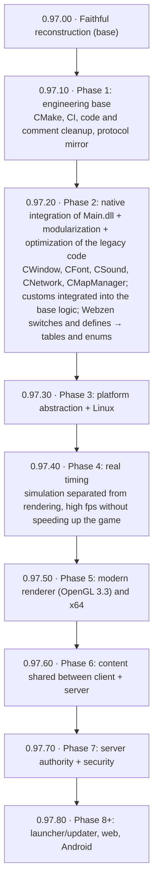
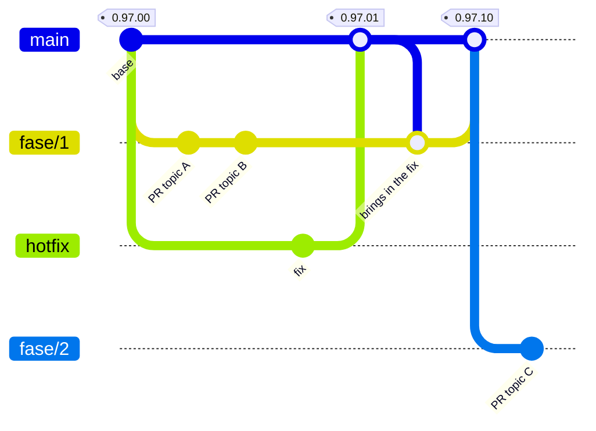

# Mu Online 0.97k — source code reconstruction

[](https://mu-linux.com/es/)

[🇪🇸 Español](README.md) | 🇺🇸 English | [🇧🇷 Português](README.pt-BR.md)

A C++ port of the **Mu Online 0.97k** client (`main.exe`, MD5
`eb95ac0785e40a7ad60c9ddb5d8bef34`), reverse-engineered from the original
binary.

The goal is for the compiled client to **behave the same as the original
binary**: same login flow, same rendering, same packets. This is not a rewrite
nor a "client inspired by" — every function is a port of its counterpart in the
binary, and deliberate deviations are documented in a comment next to the code.

**The code and its comments are in Spanish.** Symbols that could already be
identified are named by responsibility; their canonical definition keeps an
`IDA: FUN_xxxxxxxx` or `IDA: DAT_xxxxxxxx` comment to preserve traceability back
to the binary.

---

## Status

**Works end-to-end**: it starts, connects, logs in, picks a character, enters
the world and is playable. Terrain, characters, inventory, equipment, chat,
party, guild, shop, vault, basic combat and effects are all operational.

It is not a finished client: some subsystems still have known gaps, and port
bugs keep surfacing as new code paths get exercised. The most partial area today
is NPC and monster movement.

### By subsystem

| Subsystem | Status |
|---|---|
| Startup, window, OpenGL | Complete |
| Login + server select (includes the ConnectServer flow) | Complete, verified against a real server |
| Character select | Working |
| Network / protocol (85+ opcodes) | Complete for everything exercised; new opcodes show up as new features get used |
| Terrain, lighting, water | Complete |
| Character and equipment rendering | Working |
| Effects, joints, particles, weather | Working |
| Inventory, equipment, vault, shop, trade | Working |
| Chat, party, guild | Working |
| Sound (DirectSound) | Working |
| Music (BGM) | Complete: played by miniaudio inside the client; accepts mp3, wav and flac (the original launched `MuPlayer.exe`) |
| Text and language | UI in Spanish. The port opens a fixed `Text.bmd`, which here is the `_Spn` variant; the `_Eng`/`_Por` variants do ship in `Data/Local/`, but the language selector comes from the DLL and is not ported |
| Combat | `Attack`, `Action` and `MoveCharacterVisual` audited 1:1 against IDA, together with their executor chains |
| NPC / monster movement | Partial |

> **While the selector is not ported**, playing in another language is just a
> matter of replacing the base files in `bin/Client/Data/Local/` with the
> variant you want: copy `Text_Eng.bmd` over `Text.bmd` and `Dialog_Eng.bmd`
> over `Dialog.bmd` (or the `_Por` ones). Keep a copy of the originals first.
> Item, skill and quest names are **already in English** and have no variants,
> so those do not change either way.

### Architecture and technical debt

The ported code is laid out by domain (`Render/`, `Terrain/`, `UI/`, `Item/`,
`Entity/`, `Combat/`, `Net/`, `Scene/`, and so on); there is no longer a general
`stubs_*.cpp` dumping ground waiting to be split up. The current tree holds 249
`.cpp` files and 58 headers under `src/`.

The raw IDA decompiles that were never activated (formerly in
`src/stubs_IDA_ports.cpp`) are archived in `docs/codigo-muerto/`, outside the
build, as a reference for the decompile. The aliases and ABI bridges left in
`functions.h`/`globals.h` are not naming debt: they keep the original contract
of the ports that use them.

The `FUN_*` and `DAT_*` names that still appear in the code are not, on
their own, renaming debt. Some describe infrastructure, the CRT, GameGuard,
binary layouts, pools, or compatibility; others need research or a future port
before they can safely be given a semantic name.

---

## What you need besides this repo

Almost nothing: the **game assets are already included** in `bin/Client/Data/`
(~209 MB — `.bmd` models, `.ozj`/`.ozt` textures, maps, sounds and music).
Clone, build, run.

The only thing **not** included is the **original `main.exe`**, which you only
need if you want to decompile it yourself to verify a port against the binary.
It comes with any 0.97k client distribution; check the MD5
(`eb95ac0785e40a7ad60c9ddb5d8bef34`) before comparing addresses, because there
are many patched variants floating around and they do not match.

You also need a **server**. The port is validated against
[MuEmu - Linux](https://github.com/EmanuelCatania/Mu-Linux-0.97k) (season
0.97k), which is the authoritative source for packet layouts. The Windows
version [MuEmu - Kayito](https://github.com/nicomuratona/MuEmu-0.97k-kayito)
(season 0.97k) also works.

---

## Building

Requires **Visual Studio 2022** with the C++ desktop toolset (it ships CMake).
There are two equivalent ways, and both produce the same exe:

- **Visual Studio:** open `mu97k.sln`, pick **Debug** or **Release** with the
  **Win32** platform, and build.
- **CMake:**
  ```
  cmake -S . -B build -A Win32 -T v143
  cmake --build build --config Release
  ```
  The first command also generates `build/mu97k.sln`, in case you want to keep
  working in Visual Studio with the `src/` folders shown as filters.

While both coexist, a new `.cpp` goes into the `.vcxproj` **and** into
`CMakeLists.txt`; CI fails if the two lists don't match.

**The platform must be Win32 (x86).** The whole port assumes 32-bit pointers:
the original binary's addresses, struct layouts and memory pools. It does not
build on x64, and it would be useless if it did.

Output: `bin/Client/main.exe`. The project links straight into `bin/Client/`,
which is where the assets and `Config.ini` live, so there is no intermediate
copy and no risk of running a stale binary.

Linked libraries (all from the Windows SDK, except libjpeg, which is bundled):
`opengl32.lib`, `glu32.lib`, `winmm.lib`, `ws2_32.lib`.

### Pointing it at your server

The server address and identity are **compiled into the client**, as in MU 5.2:
there is no config file to ship. They live in `src/Config/ServerConfig.h` and
point to the project's reference server; to use yours, edit that file and
rebuild.

The address can be an IP or a host name (the client resolves it through DNS,
like the original). A name is better: no public IP is hardcoded and the server
can move without a rebuild. If the domain is on Cloudflare, the record must be
**unproxied** ("DNS only"): the proxy only lets web traffic through and cuts the
game connections.

```cpp
constexpr char           ConnectServerIP[]   = "mu.server-pups.space";
constexpr unsigned short ConnectServerPort   = 44405;   // 0 = no ConnectServer
constexpr char           GameServerIP[]      = "mu.server-pups.space";
constexpr unsigned short GameServerPort      = 55901;
constexpr char           CustomerName[]      = "MuLinux";
constexpr char           ServerSerial[]      = "TbYehR2hFUPBKgZj";
constexpr char           ClientVersion[]     = "0.97.11";
```

**Addresses.** With a non-zero `ConnectServerPort` the ConnectServer flow is
used: the client requests the real list (`F4/02`), the server answers with names
and load, and picking one sends `F4/03`, which redirects to the GameServer; if
the ConnectServer does not answer, it connects to the GameServer. With `0` it
connects straight to the GameServer and the server-select shows a fixed entry.

> The server-select **always** shows up, even when pointing straight at the
> GameServer: it is a screen of the original flow, not a sign that you are
> reaching the ConnectServer.

**Server identity.** All three values must match the GameServer's
(`MuServer/GameServer/DATA/GameServerInfo - StartUp.dat`). If any of them does
not match, the client **connects but never gets in**, with no useful message:

| Value | Where it comes from | What happens if it doesn't match |
|---|---|---|
| `CustomerName` | `CustomerName=` in the `.dat` | The client connects, decrypts garbage and hangs on *"connecting to the GameServer"* forever |
| `ServerSerial` | `ServerSerial=` in the `.dat` | Same as above, **and** the login returns *"wrong version"* |
| `ClientVersion` | `ServerVersion=` in the `.dat` | Login rejected with *"wrong version"* |

`CustomerName` and `ServerSerial` feed the encryption key, which the GameServer
derives from both combined (`GameServer/HackCheck.cpp::InitHackCheck`).
`ServerSerial` does double duty: it goes into that derivation and the server
also compares it byte by byte at login. `ClientVersion` accepts `0.97.11` or
`09711`.

**To troubleshoot**, `bin/Client/debug.log` records the address in use and the
derived key at startup:

```
ServerConfig: ConnectServer=mu.server-pups.space:44405 GameServer=mu.server-pups.space:55901 version='09711'
MuEmu: InitKeys CustomerName='MuLinux' Serial='TbYehR2hFUPBKgZj' -> EncDecKey1=0xC2 EncDecKey2=0x01 (xor=0xC2 add=0xC2)
```

If the client hangs while connecting, that line is the first thing to check:
compare it with the server's `CustomerName`.

### Running and player options

Run `bin/Client/main.exe`.

Player preferences are read from **`bin/Client/Config.ini`**, with the same
sections and keys the `Main.dll` injection DLL used, so the `Config.ini` you
already have works. The original 0.97k read them from the Windows registry,
where the official launcher left them: if a key is missing from `Config.ini`,
the registry wins, and if it is not there either, the binary's default. What was
applied is logged to `debug.log` (`Config.ini: ...` line).

| Key | Binary default | Notes |
|---|---|---|
| `[Window] WindowMode` | — (deviation) | `1` = windowed, `0` = fullscreen. The 0.97k only runs fullscreen and looks for a 16-bit video mode that does not exist on Windows 10/11. |
| `[Window] Borderless` | — (deviation) | `1` = no title bar or border. Windowed mode only. |
| `[Window] Resolution` | `0` (640x480) | DLL indices: `0` 640x480, `1` 800x600, `2` 1024x768, `3` 1280x1024, `4` 1280x720, `5` 1366x768, `6` 1600x900, `7` 1920x1080. Note: `4` is not the registry's `4` (there it is 1600x1200). The widescreen ones (`4` to `7`) are not tested in this client yet. |
| `[Sound] EnableSound` | `1` | Sound effects (DirectSound). |
| `[Sound] EnableMusic` | `0` (off) | The repo's `Config.ini` ships it as `1`. Each theme plays once; the login one is `Data\Music\MuTheme.mp3`, which the pack does not include. |
| `[Sound] SoundLevel`, `MusicLevel` | — (deviation) | Effects and music volume, from `0` (muted) to `9` (original volume); like the DLL, each level is 6.25 dB. The repo's `Config.ini` ships `4`. |
| `[User] Username` | — | Prefills the login username field. |
| `[Font] FontName`, `FontHeight`, `FontBold`, `FontItalic`, `FontCharset`, `FontWidth`, `FontUnderline`, `FontQuality`, `FontStrikeOut` | Arial, height by resolution | Like the DLL: fixed height (capped at 25) and the big font at twice the size. The repo's `Config.ini` ships Verdana 13. If the whole `[Font]` section is removed, the client goes back to the original font. |

The `[Antilag]`, `[MiniMap]` and `[Language]` sections of the DLL's
`Config.ini` will be read as those systems get integrated (Phase 2 of the
roadmap).

---

## How to add custom items

With the injected `Main.dll`, a custom item had to be added on both sides: the
server defined it in its `Item.txt`, and the client needed a regenerated
`item.bmd` plus the `Encoder` `.txt` files (`CustomItem.txt`, `CustomGlow.txt`,
etc.) packed into `ClientInfo.bmd`. If client and server disagreed, the item
rendered wrong or the server rejected it.

Now **the server is the only source**. On login it sends the client a catalog
with every definition (items, monsters, effects, pets). The client **only needs
the model files** (`.bmd` and textures) under `bin/Client/Data`. No `item.bmd`
to regenerate and no code to touch.

The DLL's `Encoder` `.txt` files are still read from the server's
`Data/Custom/Encoder`, so a customs folder built for the DLL works without
converting anything.

### Indexes: the classic range and the extended one

In 0.97k every item section (swords, axes, …, jewels) has **32 indexes** (0 to
31). On top of that, every section accepts indexes **32 to 511**: those are the
*added* items. On the wire they use 13 bits (an item is 7 bytes instead of 5),
so they never collide with a vanilla item.

An added item has to say **which vanilla item it behaves like** (the *Behavior*
column): that drives the logic 0.97k hardcodes per item type (whether it is a
bow and uses arrows, whether it is a wing, a jewel, which excellent options it
can roll). Everything else —name, stats, size, model, glow, effects— comes from
its own row.

### Example 1: the Knight Blade, the DLL way

The item sits inside the classic range (`0,20`); model and glow are defined in
the `Encoder`:

```
// Data/Custom/Encoder/CustomItem.txt
00,020		22		"Sword21"		// Knight Blade

// Data/Custom/Encoder/CustomGlow.txt
00,020		191	165	127		// Knight Blade
```

Client assets: `bin/Client/Data/Item/Custom/20/` (`sword21.bmd` and its
textures).

### Example 2: the Crimson Knight Blade, outside the classic range

The same model as an added item (`0,32`), all in one row of
`Data/Item/Item.txt`. After the usual columns come: behavior, model folder and
name, and the glow color (RGB):

```
32	0	22	1	4	1	1	0	"Crimson Knight Blade"	...	00,020	"Item\Custom\20\"	"Sword21"	255	40	40
```

It behaves like the Knight Blade (`00,020`), uses the `Sword21` model and glows
red. Test command: `/make 0 32`.

### Example 3: the Great Dragon set

Five pieces at index `21` of sections 7 to 11, with the model defined in the
`Encoder`'s `CustomItem.txt` (as with the DLL):

```
07,021		0		"HelmMale22"		// Great Dragon Helm
08,021		0		"ArmorMale22"		// Great Dragon Armor
09,021		0		"PantMale22"		// Great Dragon Pant
10,021		0		"GloveMale22"		// Great Dragon Glove
11,021		0		"BootMale22"		// Great Dragon Boot
```

Client assets: `bin/Client/Data/Player/Custom/21/`. The same pieces can also be
defined without the `Encoder`, with the model columns in `Item.txt`
(`"Player\Custom\21\" "HelmMale22"`).

### Example 4: custom effects and inventory pose

`Data/Custom/Items/<section>_<index>.json` gives an item (custom or vanilla) its
inventory pose and effects the client draws on the model's bones. For example,
wings with the sparkles of the 5.2 Wings of Illusion:

```json
{
  "item": "12,032",
  "effects": [
    { "on": "equipped", "type": "sprite", "texture": "Effect/Flare.jpg",
      "bones": [5, 6, 7, 8, 18, 19], "color": [0.5, 0.0, 0.0], "scale": 0.6,
      "pulse": { "speed": 0.002, "scale": 0.2, "color": 0.4 } },
    { "on": "equipped", "type": "particle", "particle": 1230,
      "bones": [13, 31], "chance": 2, "color": [0.8, 0.8, 0.3], "scale": 0.5 }
  ]
}
```

The server repo has a real case: `Data/Custom/Items/03_000.json` fixes the
position of the (vanilla) Light Spear in its inventory cell, using the 5.2
correction.

### Example 5: a custom pet (Pet Rudolph)

The 5.2 Rudolph as a pet that circles the player and picks up nearby zen. It
uses a high index (`13,400`) on purpose, to show off the extended range. Four
files, all included in the repos:

| Where | File | What it defines |
|---|---|---|
| client | `bin/Client/Data/Item/Custom/Rudolph/` | the `xmas_deer.bmd` model and its textures |
| server | `Data/Item/Item.txt` | the item row: `Slot` 8 (helper), behavior `*` (it does not mimic any vanilla pet) and the model |
| server | `Data/Custom/Items/13_400.json` | the inventory pose |
| server | `Data/Custom/Pets/13_400.json` | how it moves and what it does |

```json
{
  "item": "13,400",
  "blendMesh": 0,
  "movement": { "type": "orbit", "radius": 50, "period": 4000, "height": 20 },
  "abilities": [ { "type": "pickup", "what": "zen", "range": 3, "interval": 1000, "delay": 1500 } ]
}
```

The client draws the movement; the abilities (picking up zen) are run by the
server, which is the one that decides. Test command: `/make 13 400`.

### Example 6: a custom monster (Karane)

The DLL way, with `Data/Custom/Encoder/CustomMonster.txt` (index, type
`0`=NPC `1`=monster, golden, scale, folder and model):

```
152		1		1		2.0		"Monster\\Karane\\"		"Karane"		// Karane
```

Or directly in `Data/Monster/Monster.txt`, with the same columns at the end of
the monster's row:

```
152	0	"Karane"	...	0	0	1	1	2.0	"Monster\Karane\"	"Karane"
```

Client assets: `bin/Client/Data/Monster/Karane/`.

### Reference

Optional columns at the end of each `Item.txt` row (`*` = no value):

| Column | Example | What it does |
|---|---|---|
| Behavior | `00,020` | vanilla item it behaves like |
| Model folder and name | `"Item\Custom\20\" "Sword21"` | model in the inventory, on the ground and on the character |
| Glow | `255 40 40` | per-level glow color |
| Worn model folder and name | `"Item\Custom\FenrirMount\" "fenril_black"` | only if the item looks different when worn (a mount) |
| Gate | `22` | for scrolls: always takes you to that gate |

`Data/Custom/Items` JSON files also accept `"tooltip"`: up to 6 extra lines
below the item name, as plain text (`"Zen picker"`) or with a color
(`{ "text": "Zen picker", "color": "gold" }`; colors: `white`, `blue`, `red`,
`gold`, `green`, `darkred`, `purple`, `darkblue`, `darkgold`).

For custom wings, `Data/Item/CustomWing.txt` adds the defense and damage
constants. The `Data/Custom/Items` and `Data/Custom/Pets` JSON files are
validated when the server starts: a file with errors is dropped whole and the
reason goes to `GameServer/LOG`.

---

## Layout

```
mu97k-src/
├── mu97k.sln            VS2022 solution
├── mu97k.vcxproj        project (Win32)
├── lib/libjpeg/         libjpeg 6b (decodes the .ozj textures)
└── src/
    ├── WinMain.cpp      entry point + WndProc + message loop
    ├── globals.{h,cpp}  global state; identified DATs keep their IDA traceability
    ├── functions.h      shared declarations and the IDA provenance of renamed symbols
    ├── structs.h        struct layouts verified against IDA
    ├── ghidra_compat.h  macros the Ghidra decompile assumes exist
    │                    (qmemcpy, LODWORD, SLOBYTE, ...)
    │
    ├── Combat/  Config/  Core/    Entity/  Game/     GameGuard/ Input/ Item/
    ├── Local/   Math/    Model/   Monster/ Net/       Party/     Path/  Physics/
    └── Render/  Scene/   Sound/   Terrain/ Trade/     UI/        Util/
```

Modules group by responsibility. The address in the binary is still an important
clue for verifying a function or resolving a symbol, but it does not determine
where the ported code lives.

---

## How to work on this

### The main rule: faithful to the binary

The order of authority for settling any question:

1. **IDA / the original binary.** It is the truth. If the decompile says
   something strange, odds are the decompile is right and our intuition is not.
2. **The MuEmu server**, for anything about packet layouts.
3. **The injection DLL**, as a secondary behavioral reference.
4. **The Mu Online 5.2 source**, only as semantic and naming support when the
   current context allows it. Implementation is not copied and 5.2 behavior is
   not incorporated: its UI, definitions and features can differ from 0.97k.

Anything not in one of those sources is not invented. If a deviation is needed
(because a path in the original is unreachable, or depends on something not
ported yet), it gets implemented **and documented in a comment right there**,
explaining what the original does and why we departed from it.

The only thing deliberately skipped is the anti-tamper noise: the interleaved
hash-table operations, the unreachable blocks and the XOR scrambling of the
protected build. None of that is game logic.

### Known pitfalls

These cost entire debugging sessions. Every one of them came back more than
once.

**1. Duplicate symbols.** The same name defined twice: an old stub and the real
port. C++ can accept it as an overload if the signatures differ, and then each
caller resolves to a different copy. Typical symptom: a value gets corrupted and
no writer explains it. Before auditing any function, confirm you are reading
**the copy that actually compiles** — not one inside `#if 0`, nor one behind an
undefined `IDA_PORT_*` macro. Corollary: a diagnostic probe placed in dead code
returns zero results, and that silence looks like evidence that there is no bug.

**2. Locals that Ghidra split apart.** The decompile emits as separate variables
what was a contiguous block in the original frame, and the code walks them as if
they still were (`&local_XX` of a scalar passed as a `vec3`). The compiler does
not guarantee that layout. Symptom: the first component comes out fine and the
rest is garbage (values around 1e9). The fix is rebuilding the frame as one
contiguous array and mapping the names by offset.

**3. Integer fields read as float.** Ghidra types the slot as `float*` and then
*every* access comes out as a float, including the fields that are integers or
pointers. `(float)(uintptr_t)ptr` numerically converts what should have been
reinterpreted bit-wise. Symptom: it is not a crash, it is functionality that
simply never happens — comparisons that never come out true, pointers left at
zero, counters stuck. Hint: values around 1e9 that, read as bits, give small
sensible floats. Correct and broken accesses often coexist in the same file;
that mix is the giveaway.

**4. Struct padding in packets.** The server sends C structs with their
alignment padding. Reading fields at the "logical" offset instead of the real one
returns convincing garbage. It has already bitten in the stats, the guild list
and the damage numbers.

**5. Offset labels lie.** Several fields of the entity struct were mislabeled for
months (`+0x1BC` is not movement flags: it is the character class; `+0x34E` is
not "dead": it is SafeZone). Before trusting an offset's name, find who
**writes** it in the binary.

**6. Similarly named functions with opposite effects.** The recurring case is
the OpenGL state family: `EnableAlphaTest` (0x511680), `EnableAlphaBlend`
(0x511710, additive) and `DisableTexture` (0x511590, which turns texturing off).
Mixing them up paints white squares over half the frame, because GL state is
sticky and contaminates everything drawn afterwards.

**7. Invented bounds and clears.** Guards the binary does not have which, instead
of clamping, **discard the whole input**. It showed up on both sides: in the
network handlers (`count > 30` threw away all 41 monsters in a viewport; the
symptom read as a spawn bug, with a cascade of `key not found` in the log) and in
the input tick (an `else` that, on blocking the debounce, did
`MouseLButtonPush = 0; MouseLButton = 0;`, i.e. it lost the click: you had to
click several times to walk). Rule of thumb: any `= 0` or `clear` the port adds
on the *"not possible yet"* path is suspect — the binary almost always leaves the
state pending for the next tick.

### Protocol deviations

They are documented in the code, but they are worth knowing if you point the
client at a different server:

- **`C3:1E` (duration skill) is sent with 11 bytes, not 9.** Vanilla 0.97k does
  not include `index[]`, but MuEmu's `CGDurationSkillAttackRecv` always reads it
  (`SkillManager.cpp:2047`): with 9 bytes the server takes those two bytes from
  outside the packet and the skill hits a different entity. The injection DLL
  does the same (`CPatchs::SendRequestMagicContinue`).
- **Triple Shot sends the `angle` byte.** The server builds the cone from
  `angle`, not from `dir` (`SkillManager.cpp:1185`).
- **F3/12 on entering the world.** Without that ACK the server leaves `RegenOk`
  at 1 and rejects every later `/move`, on top of not sending the map's
  entities.

---

## License

MIT — see [LICENSE](LICENSE).

The license covers **the code**: everything under `src/`.

It does **not** cover the assets in `bin/Client/Data/`, which
are copyright of WebZen Inc. and are in the repo only because it is private and
for internal use among collaborators.

`lib/libjpeg/jpeg-6b` belongs to the Independent JPEG Group, under its own
permissive license (`lib/libjpeg/jpeg-6b/README`, "LEGAL ISSUES" section).

---

## Roadmap

The `0.97.00` tag closes the faithful-reconstruction stage: the client behaves like the
original binary. From there the work continues in phases, and each closed phase is a
version.



Each phase's number is the version planned for when it closes; the scope of each one
may be adjusted along the way.

### Versioning

Versions are `0.97.FH`, always two digits: **F** is the phase and **H** the
hotfix.

| Tag | What it is |
|---|---|
| `0.97.00` | base of the faithful reconstruction |
| `0.97.01`, `0.97.02`… | fixes on top of the base |
| `0.97.10` | close of Phase 1 |
| `0.97.11`, `0.97.12`… | fixes on top of Phase 1 |
| `0.97.20` | close of Phase 2, and so on |

The client and the [server](https://github.com/EmanuelCatania/Mu-Linux-0.97k) use the
same numbering, but the server only gets a new tag when it changes. Each client
Release states which server tag it works with (for example, client `0.97.10`
works with server `0.97.00`). Each Season will have its own line (`0.99.FH`, …).

### Branches



- `main` only receives phase closes and fixes; each merge gets its tag and its
  Release.
- Each phase is worked on in `fase/N`. Topic branches (`fix/…`, `feat/…`, `chore/…`)
  branch off `fase/N` and come back through a PR.
- A fix to a published version branches off the affected tag, is merged into `main`
  with its new tag, and also into the phase in progress.
- Releases publish only the source code: each one builds the client with its own
  server's data.
