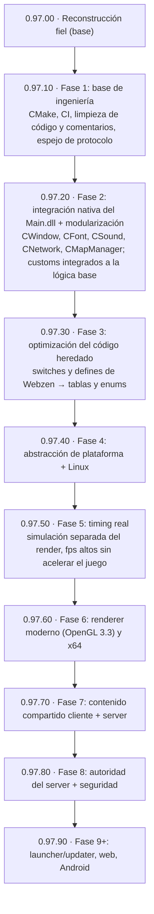
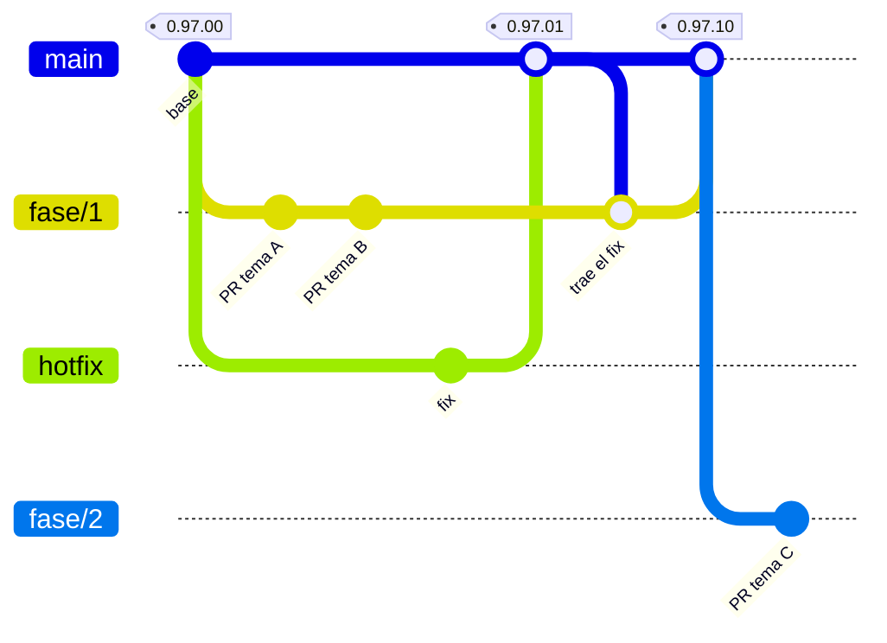

# Mu Online 0.97k — reconstrucción del código fuente

[](https://mu-linux.com/es/)

🇪🇸 Español | [🇺🇸 English](README.en.md) | [🇧🇷 Português](README.pt-BR.md)

Port a C++ del cliente **Mu Online 0.97k** (`main.exe`, MD5
`eb95ac0785e40a7ad60c9ddb5d8bef34`), reconstruido por ingeniería inversa a
partir del binario original.

El objetivo es que el cliente compilado **se comporte igual que el binario
original**: mismo flujo de login, mismo render, mismos paquetes. No es un
reescritura ni un "cliente inspirado en" — cada función es un port de su
contraparte en el binario, y las desviaciones deliberadas están documentadas
en un comentario junto al código.

El código está en español. Los símbolos que ya pudieron identificarse se
nombran por responsabilidad; su definición canónica conserva un comentario
`IDA: FUN_xxxxxxxx` o `IDA: DAT_xxxxxxxx` para mantener la trazabilidad con el
binario.

---

## Estado

**Funciona end-to-end**: arranca, conecta, hace login, elige personaje, entra
al mundo y se juega. Terreno, personajes, inventario, equipo, chat, party,
guild, tienda, baúl, combate básico y efectos están operativos.

No es un cliente terminado: quedan subsistemas con huecos conocidos y bugs de
port apareciendo a medida que se ejercitan caminos nuevos. Lo mas parcial hoy es
el movimiento de NPCs y monstruos.

### Por subsistema

| Subsistema | Estado |
|---|---|
| Arranque, ventana, OpenGL | Completo |
| Login + select-server (incluye flujo ConnectServer) | Completo, verificado contra server real |
| Select-character | Funcional |
| Red / protocolo (85+ opcodes) | Completo en lo ejercitado; opcodes nuevos aparecen al usar features nuevas |
| Terreno, iluminación, agua | Completo |
| Render de personajes y equipo | Funcional |
| Efectos, joints, partículas, clima | Funcional |
| Inventario, equipo, baúl, tienda, trade | Funcional |
| Chat, party, guild | Funcional |
| Sonido (DirectSound) | Funcional |
| Música (BGM) | Completo: la reproduce miniaudio dentro del cliente; acepta mp3, wav y flac (el original lanzaba `MuPlayer.exe`) |
| Textos e idioma | UI en español. El port abre `Text.bmd` fijo, que acá es la variante `_Spn`; las variantes `_Eng`/`_Por` vienen en `Data/Local/`, pero el selector de idioma lo aporta el DLL y no está portado |
| Combate | `Attack`, `Action` y `MoveCharacterVisual` auditadas 1:1 contra IDA, con sus cadenas de ejecutores |
| Movimiento de NPCs / monstruos | Parcial |

> **Mientras el selector no esté portado**, para jugar en otro idioma alcanza
> con reemplazar los archivos base de `bin/Client/Data/Local/` por la variante
> que quieras: copiar `Text_Eng.bmd` sobre `Text.bmd` y `Dialog_Eng.bmd` sobre
> `Dialog.bmd` (o los `_Por`). Guardá una copia de los originales antes. Los
> nombres de items, skills y quests **ya están en inglés** y no tienen variante,
> así que esos no cambian en ningún caso.

### Arquitectura y deuda técnica

El código portado está distribuido por dominio (`Render/`, `Terrain/`, `UI/`,
`Item/`, `Entity/`, `Combat/`, `Net/`, `Scene/`, etc.); ya no existe un depósito
general de `stubs_*.cpp` pendiente de repartir. El árbol actual contiene 249
archivos `.cpp` y 58 headers bajo `src/`.

Los decompilados crudos de IDA que nunca se activaron (antes en
`src/stubs_IDA_ports.cpp`) están archivados en `docs/codigo-muerto/`, fuera
del build, como referencia del decompile. Los aliases o bridges ABI que
quedan en `functions.h`/`globals.h` no son deuda de nomenclatura: mantienen el
contrato original de los ports que los usan.

Los `FUN_*` y `DAT_*` que todavía aparecen en el código no son, por sí
solos, deuda de renombrado. Algunos describen infraestructura, CRT, GameGuard,
layouts binarios, pools o compatibilidad; otros requieren investigación o un
port futuro antes de poder recibir un nombre semántico seguro.

---

## Qué necesitás además de este repo

Casi nada: los **assets del juego ya están incluidos** en `bin/Client/Data/`
(~209 MB — modelos `.bmd`, texturas `.ozj`/`.ozt`, mapas, sonidos y música).
Clonás, compilás y arranca.

Lo único que **no** está es el **`main.exe` original**, que sólo hace falta si
querés decompilarlo vos mismo para verificar un port contra el binario. Sale de
cualquier distribución del cliente 0.97k; verificá el MD5
(`eb95ac0785e40a7ad60c9ddb5d8bef34`) antes de comparar direcciones, porque hay
muchas variantes parcheadas dando vueltas y no coinciden.

También necesitás un **servidor**. El port está validado contra
[MuEmu - Linux](https://github.com/EmanuelCatania/Mu-Linux-0.97k) (season 0.97k), que es la fuente autoritativa
para el formato de los paquetes. Tambien se puede utilizar la version de windows [MuEmu - Kayito](https://github.com/nicomuratona/MuEmu-0.97k-kayito) (season 0.97k)

---

## Compilar

Requiere **Visual Studio 2022** con el toolset de C++ para escritorio (trae
CMake). Hay dos formas equivalentes, que generan el mismo exe:

- **Visual Studio:** abrir `mu97k.sln`, elegir **Debug** o **Release** con
  plataforma **Win32**, y compilar.
- **CMake:**
  ```
  cmake -S . -B build -A Win32 -T v143
  cmake --build build --config Release
  ```
  El primer comando también genera `build/mu97k.sln`, por si querés seguir en
  Visual Studio con las carpetas de `src/` como filtros.

Mientras convivan los dos, un `.cpp` nuevo se agrega en el `.vcxproj` **y** en
el `CMakeLists.txt`; el CI falla si las dos listas no coinciden.

**La plataforma tiene que ser Win32 (x86).** Todo el port asume punteros de 32
bits: las direcciones del binario original, los layouts de struct y los pools
de memoria. En x64 no compila, y si compilara no serviría.

Salida: `bin/Client/main.exe`. El proyecto enlaza directo sobre `bin/Client/`,
que es donde viven los assets y `Config.ini`, así que no hay copia intermedia ni
riesgo de terminar ejecutando un binario viejo.

Librerías enlazadas (todas del SDK de Windows, salvo libjpeg que va incluida):
`opengl32.lib`, `glu32.lib`, `winmm.lib`, `ws2_32.lib`.

### Apuntar a tu server

La dirección y la identidad del server van **compiladas en el cliente**, como en
MU 5.2: no hay archivo de configuración que distribuir. Están en
`src/Config/ServerConfig.h` y apuntan al server de referencia del proyecto; para
usar el tuyo, editá ese archivo y recompilá.

La dirección puede ser una IP o un nombre de host (el cliente lo resuelve por
DNS, igual que el original). Conviene un nombre: así no queda una IP pública
fija en el código y el server puede mudarse sin recompilar. Si el dominio está en
Cloudflare, el registro tiene que ir **sin proxy** ("DNS only"): el proxy sólo
deja pasar tráfico web y corta las conexiones del juego.

```cpp
constexpr char           ConnectServerIP[]   = "mu.server-pups.space";
constexpr unsigned short ConnectServerPort   = 44405;   // 0 = sin ConnectServer
constexpr char           GameServerIP[]      = "mu.server-pups.space";
constexpr unsigned short GameServerPort      = 55901;
constexpr char           CustomerName[]      = "MuLinux";
constexpr char           ServerSerial[]      = "TbYehR2hFUPBKgZj";
constexpr char           ClientVersion[]     = "0.97.11";
```

**Direcciones.** Con `ConnectServerPort` distinto de 0 se usa el flujo
ConnectServer: el cliente pide la lista real (`F4/02`), el server contesta con
nombres y ocupación, y al elegir uno el `F4/03` redirige al GameServer; si el
ConnectServer no responde, se conecta al GameServer. Con `0` se conecta directo
al GameServer y el select-server muestra una entrada fija.

> El select-server aparece **siempre**, incluso apuntando directo al GameServer:
> es una pantalla del flujo original, no un indicio de que estés llegando al
> ConnectServer.

**Identidad del server.** Los tres valores tienen que coincidir con los del
GameServer (`MuServer/GameServer/DATA/GameServerInfo - StartUp.dat`). Si alguno
no coincide, el cliente **conecta pero no entra**, y sin ningún mensaje útil:

| Valor | De dónde sale | Qué pasa si no coincide |
|---|---|---|
| `CustomerName` | `CustomerName=` del `.dat` | El cliente conecta, desencripta basura y se queda en *"conectando al GameServer"* para siempre |
| `ServerSerial` | `ServerSerial=` del `.dat` | Igual que arriba, **y además** el login devuelve *"versión incorrecta"* |
| `ClientVersion` | `ServerVersion=` del `.dat` | Login rechazado con *"versión incorrecta"* |

`CustomerName` y `ServerSerial` alimentan la clave de encriptación, que el
GameServer deriva de los dos combinados (`GameServer/HackCheck.cpp::InitHackCheck`).
`ServerSerial` cumple doble función: entra en esa derivación y además el server
lo compara byte a byte en el login. `ClientVersion` acepta `0.97.11` o `09711`.

**Para diagnosticar**, `bin/Client/debug.log` registra al arrancar la dirección
usada y la clave derivada:

```
ServerConfig: ConnectServer=mu.server-pups.space:44405 GameServer=mu.server-pups.space:55901 version='09711'
MuEmu: InitKeys CustomerName='MuLinux' Serial='TbYehR2hFUPBKgZj' -> EncDecKey1=0xC2 EncDecKey2=0x01 (xor=0xC2 add=0xC2)
```

Si el cliente se queda colgado conectando, esa línea es lo primero que hay que
mirar: comparala con el `CustomerName` del server.

### Ejecutar y opciones del jugador

Ejecutar `bin/Client/main.exe`.

Las preferencias del jugador se leen de **`bin/Client/Config.ini`**, con las
mismas secciones y claves que usaba el `Main.dll` de inyección, así sirve el
`Config.ini` que ya tengas. El 0.97k original las leía del registro de Windows,
que es donde las dejaba el launcher oficial: si una clave no está en
`Config.ini`, manda el registro, y si tampoco está ahí, el default del binario.
Lo que se aplicó queda en `debug.log` (línea `Config.ini: ...`).

| Clave | Default del binario | Notas |
|---|---|---|
| `[Window] WindowMode` | — (desviación) | `1` = en ventana, `0` = pantalla completa. El 0.97k sólo corre fullscreen y busca un modo de video de 16 bits que en Windows 10/11 no existe. |
| `[Window] Borderless` | — (desviación) | `1` = sin barra de título ni borde. Sólo aplica en modo ventana. |
| `[Window] Resolution` | `0` (640x480) | Índices del DLL: `0` 640x480, `1` 800x600, `2` 1024x768, `3` 1280x1024, `4` 1280x720, `5` 1366x768, `6` 1600x900, `7` 1920x1080. Ojo: el `4` no es el mismo del registro (ahí es 1600x1200). Las panorámicas (`4` a `7`) todavía no están probadas en este cliente. |
| `[Sound] EnableSound` | `1` | Efectos de sonido (DirectSound). |
| `[Sound] EnableMusic` | `0` (apagada) | El `Config.ini` del repo la trae en `1`. Cada tema suena una vez; el del login es `Data\Music\MuTheme.mp3`, que el pack no trae. |
| `[Sound] SoundLevel`, `MusicLevel` | — (desviación) | Volumen de efectos y de música, de `0` (mudo) a `9` (volumen original); como en el DLL, cada nivel son 6,25 dB. El `Config.ini` del repo trae `4`. |
| `[User] Username` | — | Precarga el campo de usuario del login. |
| `[Font] FontName`, `FontHeight`, `FontBold`, `FontItalic`, `FontCharset`, `FontWidth`, `FontUnderline`, `FontQuality`, `FontStrikeOut` | Arial, alto según la resolución | Como el DLL: alto fijo (tope 25) y la fuente grande al doble. El `Config.ini` del repo trae Verdana 13. Si se borra la sección `[Font]` completa, el cliente vuelve a la fuente original. |

Las secciones `[Antilag]`, `[MiniMap]` y `[Language]` del `Config.ini`
del DLL se van a leer a medida que se integren esos sistemas (Fase 2 de la hoja
de ruta).

---

## Cómo agregar items custom

Con el `Main.dll` de inyección, un item custom se agregaba de los dos lados: el
server lo definía en su `Item.txt`, y el cliente necesitaba un `item.bmd`
regenerado más los `.txt` del `Encoder` (`CustomItem.txt`, `CustomGlow.txt`,
etc.) empaquetados en `ClientInfo.bmd`. Si cliente y server no coincidían, el
item se veía mal o el server lo rechazaba.

Ahora **el server es la única fuente**. Al loguearse, le manda al cliente un
catálogo con todas las definiciones (items, monstruos, efectos, pets). El
cliente **sólo necesita los archivos del modelo** (`.bmd` y texturas) dentro de
`bin/Client/Data`. No hay que regenerar `item.bmd` ni tocar código.

Los `.txt` del `Encoder` del DLL se siguen leyendo desde
`Data/Custom/Encoder` del server, así que una carpeta de customs armada para el
DLL funciona sin convertir nada.

### Índices: el rango clásico y el extendido

Cada sección de items (espadas, hachas, …, joyas) tiene en el 0.97k **32
índices** (0 a 31). Además, cada sección acepta índices **32 a 511**: son los
items *agregados*. En el protocolo viajan con 13 bits (el item usa 7 bytes en
vez de 5), así que entran sin pisar ningún item vanilla.

Un agregado necesita decir **qué item vanilla imita** (columna *Comportamiento*):
eso decide la lógica que el 0.97k tiene escrita por tipo de item (si es un arco
y gasta flechas, si es un ala, si es una joya, qué opciones excellent puede
tener). Todo lo demás —nombre, stats, tamaño, modelo, brillo, efectos— sale de
su propia fila.

### Ejemplo 1: la Knight Blade, como se hacía con el DLL

El item está dentro del rango clásico (`0,20`); el modelo y el brillo se
definen en el `Encoder`:

```
// Data/Custom/Encoder/CustomItem.txt
00,020		22		"Sword21"		// Knight Blade

// Data/Custom/Encoder/CustomGlow.txt
00,020		191	165	127		// Knight Blade
```

Assets en el cliente: `bin/Client/Data/Item/Custom/20/` (`sword21.bmd` y sus
texturas).

### Ejemplo 2: la Crimson Knight Blade, fuera del rango clásico

El mismo modelo como item agregado (`0,32`), todo en una fila de
`Data/Item/Item.txt`. Al final de las columnas de siempre se agregan:
comportamiento, carpeta y nombre del modelo, y el color del brillo (RGB):

```
32	0	22	1	4	1	1	0	"Crimson Knight Blade"	...	00,020	"Item\Custom\20\"	"Sword21"	255	40	40
```

Se comporta como la Knight Blade (`00,020`), usa el modelo `Sword21` y brilla en
rojo. Comando de prueba: `/make 0 32`.

### Ejemplo 3: el set Great Dragon

Cinco piezas en el índice `21` de las secciones 7 a 11, con el modelo definido
en el `CustomItem.txt` del `Encoder` (como en el DLL):

```
07,021		0		"HelmMale22"		// Great Dragon Helm
08,021		0		"ArmorMale22"		// Great Dragon Armor
09,021		0		"PantMale22"		// Great Dragon Pant
10,021		0		"GloveMale22"		// Great Dragon Glove
11,021		0		"BootMale22"		// Great Dragon Boot
```

Assets en el cliente: `bin/Client/Data/Player/Custom/21/`. Las mismas piezas
también se pueden definir sin el `Encoder`, con las columnas de modelo en
`Item.txt` (`"Player\Custom\21\" "HelmMale22"`).

### Ejemplo 4: efectos propios y pose en el inventario

`Data/Custom/Items/<sección>_<índice>.json` agrega a un item (custom o vanilla)
su pose en el inventario y efectos que el cliente dibuja sobre los huesos del
modelo. Por ejemplo, unas alas con los destellos de las Wings of Illusion del
5.2:

```json
{
  "item": "12,032",
  "effects": [
    { "on": "equipped", "type": "sprite", "texture": "Effect/Flare.jpg",
      "bones": [5, 6, 7, 8, 18, 19], "color": [0.5, 0.0, 0.0], "scale": 0.6,
      "pulse": { "speed": 0.002, "scale": 0.2, "color": 0.4 } },
    { "on": "equipped", "type": "particle", "particle": 1230,
      "bones": [13, 31], "chance": 2, "color": [0.8, 0.8, 0.3], "scale": 0.5 }
  ]
}
```

En el repo del server hay un caso real: `Data/Custom/Items/03_000.json` corrige
la posición del Light Spear (vanilla) en su casilla, con la corrección del 5.2.

### Ejemplo 5: un pet custom (Pet Rudolph)

El Rudolph del 5.2 como pet que da vueltas alrededor del jugador y levanta el
zen cercano. Va en un índice alto (`13,400`) a propósito, para que sirva de
ejemplo del rango extendido. Son cuatro archivos, todos incluidos en los repos:

| Dónde | Archivo | Qué define |
|---|---|---|
| cliente | `bin/Client/Data/Item/Custom/Rudolph/` | el modelo `xmas_deer.bmd` y sus texturas |
| server | `Data/Item/Item.txt` | la fila del item: `Slot` 8 (helper), comportamiento `*` (no imita a ningún pet vanilla) y el modelo |
| server | `Data/Custom/Items/13_400.json` | la pose en el inventario |
| server | `Data/Custom/Pets/13_400.json` | cómo se mueve y qué hace |

```json
{
  "item": "13,400",
  "blendMesh": 0,
  "movement": { "type": "orbit", "radius": 50, "period": 4000, "height": 20 },
  "abilities": [ { "type": "pickup", "what": "zen", "range": 3, "interval": 1000 } ]
}
```

El cliente dibuja el movimiento; las habilidades (levantar el zen) las ejecuta
el server, que es el que decide. Comando de prueba: `/make 13 400`.

### Ejemplo 6: un monstruo custom (Karane)

Como en el DLL, con `Data/Custom/Encoder/CustomMonster.txt` (índice, tipo
`0`=NPC `1`=monstruo, dorado, escala, carpeta y modelo):

```
152		1		1		2.0		"Monster\\Karane\\"		"Karane"		// Karane
```

O directamente en `Data/Monster/Monster.txt`, con las mismas columnas al final
de la fila del monstruo:

```
152	0	"Karane"	...	0	0	1	1	2.0	"Monster\Karane\"	"Karane"
```

Assets en el cliente: `bin/Client/Data/Monster/Karane/`.

### Referencia

Columnas opcionales al final de cada fila de `Item.txt` (`*` = sin valor):

| Columna | Ejemplo | Qué hace |
|---|---|---|
| Comportamiento | `00,020` | vanilla que imita en la lógica |
| Carpeta y modelo | `"Item\Custom\20\" "Sword21"` | modelo en el inventario, el suelo y el personaje |
| Brillo | `255 40 40` | color del brillo por nivel |
| Carpeta y modelo puesto | `"Item\Custom\FenrirMount\" "fenril_black"` | sólo si el item se ve distinto puesto (una montura) |
| Gate | `22` | para pergaminos: lleva siempre a ese gate |

Para alas custom, `Data/Item/CustomWing.txt` agrega las constantes de defensa y
daño. Los JSON de `Data/Custom/Items` y `Data/Custom/Pets` se validan al
arrancar el server: un archivo con errores se descarta entero y el motivo queda
en `GameServer/LOG`.

---

## Estructura

```
mu97k-src/
├── mu97k.sln            solución de VS2022
├── mu97k.vcxproj        proyecto (Win32)
├── lib/libjpeg/         libjpeg 6b (decodifica las texturas .ozj)
└── src/
    ├── WinMain.cpp      punto de entrada + WndProc + loop de mensajes
    ├── globals.{h,cpp}  estado global; los DAT identificados conservan trazabilidad IDA
    ├── functions.h      declaraciones compartidas y procedencia IDA de símbolos renombrados
    ├── structs.h        layouts de struct verificados contra IDA
    ├── ghidra_compat.h  macros que el decompile de Ghidra da por existentes
    │                    (qmemcpy, LODWORD, SLOBYTE, ...)
    │
    ├── Combat/  Config/  Core/    Entity/  Game/     GameGuard/ Input/ Item/
    ├── Local/   Math/    Model/   Monster/ Net/       Party/     Path/  Physics/
    └── Render/  Scene/   Sound/   Terrain/ Trade/     UI/        Util/
```

Los módulos agrupan por responsabilidad. La dirección en el binario sigue
siendo una pista importante para verificar una función o resolver un símbolo,
pero no determina la ubicación del código portado.

---

## Cómo trabajar en esto

### La regla principal: fiel al binario

El orden de autoridad para resolver cualquier duda:

1. **IDA / el binario original.** Es la verdad. Si el decompile dice algo raro,
   probablemente el decompile tenga razón y nuestra intuición no.
2. **El servidor MuEmu**, para todo lo que sea formato de paquetes.
3. **El DLL de inyección**, como segunda referencia de comportamiento.
4. **El source de Mu Online 5.2**, sólo como apoyo semántico y de nomenclatura
   cuando el contexto actual lo permite. No se copia implementación ni se
   incorpora comportamiento de 5.2: la UI, las definiciones y las features
   pueden diferir de 0.97k.

Lo que no está en ninguna de esas fuentes no se inventa. Si hace falta una
desviación (porque un camino del original es inalcanzable, o depende de algo
que todavía no está portado), se implementa **y se documenta en un comentario
ahí mismo**, explicando qué hace el original y por qué nos apartamos.

Lo único que se saltea deliberadamente es el ruido anti-tamper: las
operaciones de hash-table intercaladas, los bloques inalcanzables y el
scrambling XOR de la versión protegida. No son lógica de juego.

### Comentarios en el código

Los comentarios describen **el código actual**: la referencia a IDA
(`// IDA: <nombre> (<dirección>)`), el layout de un struct o paquete, las
desviaciones vigentes respecto del binario y las advertencias que evitan romper
algo. La historia de cómo se llegó a un fix (fechas, sondas, intentos
descartados, lo que hacía el port viejo) no va en el código: va en el mensaje
del commit o en `docs/`. Los comentarios de desarrollo que ya estaban en el
código se movieron a [`docs/historial-comentarios/`](docs/historial-comentarios/README.md);
el texto completo original sigue en el tag `0.97.00`.

### Trampas conocidas

Estas costaron sesiones enteras de depuración. Todas volvieron a aparecer
más de una vez.

**1. Símbolos duplicados.** El mismo nombre definido dos veces: un stub viejo y
el port real. C++ puede aceptarlo como sobrecarga si las firmas difieren, y
entonces cada llamador resuelve a una copia distinta. Síntoma típico: un valor
se corrompe y no aparece ningún escritor que lo explique. Antes de auditar
cualquier función, confirmá que estás leyendo **la copia que se compila** —
no una dentro de `#if 0` ni una detrás de una macro `IDA_PORT_*` sin definir.
Corolario: una sonda de diagnóstico puesta en código muerto da cero resultados,
y ese silencio parece evidencia de que no hay bug.

**2. Locales que Ghidra separó.** El decompile emite como variables sueltas lo
que en el frame original era un bloque contiguo, y el código las recorre como
si lo fueran (`&local_XX` de un escalar pasado como `vec3`). El compilador no
garantiza ese layout. Síntoma: la primera componente sale bien y el resto es
basura (valores de ~1e9). Se arregla reconstruyendo el frame como un array
contiguo y mapeando los nombres por offset.

**3. Campos enteros leídos como float.** Ghidra tipa el slot como `float*` y
entonces *todo* acceso sale como float, incluidos los campos que son enteros o
punteros. `(float)(uintptr_t)ptr` convierte numéricamente lo que había que
reinterpretar por bits. Síntoma: no es un crash, es funcionalidad que
simplemente no ocurre — comparaciones que nunca dan verdadero, punteros en
cero, contadores clavados. Pista: valores de ~1e9 que leídos como bits dan
floats chicos y razonables. Dentro de un mismo archivo suelen convivir accesos
correctos y rotos; esa mezcla es la señal.

**4. Padding de structs en los paquetes.** El servidor manda structs de C con
su padding de alineación. Leer los campos por offset "lógico" en vez del real
devuelve basura convincente. Ya mordió en los stats, en la lista de guild y en
los números de daño.

**5. Las etiquetas de los offsets mienten.** Varios campos de la struct de
entidad estuvieron mal etiquetados durante meses (`+0x1BC` no son flags de
movimiento: es la clase del personaje; `+0x34E` no es "muerto": es SafeZone).
Antes de confiar en el nombre de un offset, buscá quién lo **escribe** en el
binario.

**6. Nombres de funciones parecidos con efectos opuestos.** El caso recurrente
es la familia de estado de OpenGL: `EnableAlphaTest` (0x511680),
`EnableAlphaBlend` (0x511710, aditivo) y `DisableTexture` (0x511590, que apaga
el texturizado). Confundirlas pinta cuadrados blancos sobre medio frame,
porque el estado de GL queda pegado y contamina todo lo que se dibuje después.

**7. Cotas y limpiezas inventadas.** Guards que el binario no tiene y que en vez
de recortar **descartan la entrada entera**. Apareció de los dos lados: en los
handlers de red (`count > 30` tiraba los 41 monstruos de un viewport; el síntoma
se leía como bug de spawn, con una cascada de `key not found` en el log) y en el
input tick (un `else` que al bloquear el debounce hacía
`MouseLButtonPush = 0; MouseLButton = 0;`, o sea perdía el click: había que
clickear varias veces para caminar). Regla: cualquier `= 0` o `clear` que el port
agregue en el camino de *«todavía no se puede»* es sospechoso — el binario casi
siempre deja el estado pendiente para el próximo tick.

### Desviaciones de protocolo

Están documentadas en el código, pero conviene saberlas si se apunta a otro
servidor:

- **`C3:1E` (duration skill) se manda con 11 bytes, no 9.** El 0.97k vanilla no
  incluye `index[]`, pero `CGDurationSkillAttackRecv` de MuEmu lo lee siempre
  (`SkillManager.cpp:2047`): con 9 bytes el server toma esos dos bytes de fuera
  del paquete y el skill le pega a otra entidad. El DLL de inyección hace lo
  mismo (`CPatchs::SendRequestMagicContinue`).
- **Triple Shot manda el byte `angle`.** El server arma el cono con `angle`, no
  con `dir` (`SkillManager.cpp:1185`).
- **F3/12 al entrar al mundo.** Sin ese ACK el server deja `RegenOk` en 1 y
  rechaza todo `/move` posterior además de no mandar las entidades del mapa.

---

## Licencia

MIT — ver [LICENSE](LICENSE).

La licencia cubre **el código**: todo lo que está bajo `src/`.

**No** cubre los assets de `bin/Client/Data/`, que son
copyright de WebZen Inc. y están en el repo sólo porque es privado y de uso
interno entre colaboradores.

`lib/libjpeg/jpeg-6b` es del Independent JPEG Group, bajo su propia licencia
permisiva (`lib/libjpeg/jpeg-6b/README`, sección "LEGAL ISSUES").

---

## Hoja de ruta

El tag `0.97.00` cierra la etapa de reconstrucción fiel: el cliente se comporta como el
binario original. A partir de ahí el trabajo sigue por fases, y cada fase cerrada es una
versión.



Los números de cada fase son la versión prevista al cerrarla; el alcance de cada una
puede ajustarse en el camino.

### Versionado

Las versiones son `0.97.FH`, siempre de dos dígitos: **F** es la fase y **H** el
hotfix.

| Tag | Qué es |
|---|---|
| `0.97.00` | base de la reconstrucción fiel |
| `0.97.01`, `0.97.02`… | correcciones sobre la base |
| `0.97.10` | cierre de la Fase 1 |
| `0.97.11`, `0.97.12`… | correcciones sobre la Fase 1 |
| `0.97.20` | cierre de la Fase 2, y así sucesivamente |

El cliente y el [server](https://github.com/EmanuelCatania/Mu-Linux-0.97k) usan la
misma numeración, pero el server sólo recibe un tag nuevo cuando cambia. Cada
Release del cliente indica con qué tag del server funciona (por ejemplo, el
cliente `0.97.10` funciona con el server `0.97.00`). Cada Season tendrá su propia
línea (`0.99.FH`, …).

### Ramas



- `main` sólo recibe cierres de fase y correcciones; cada merge lleva su tag y su
  Release.
- Cada fase se trabaja en `fase/N`. Las ramas de tema (`fix/…`, `feat/…`, `chore/…`)
  salen de `fase/N` y vuelven por PR.
- Una corrección sobre una versión publicada sale del tag afectado, se mergea a `main`
  con su nuevo tag y también a la fase en curso.
- Los Releases publican sólo el código fuente: cada uno compila el cliente con los datos
  de su server.
