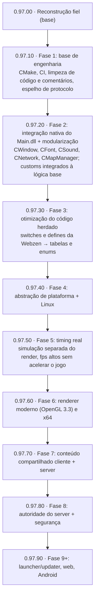
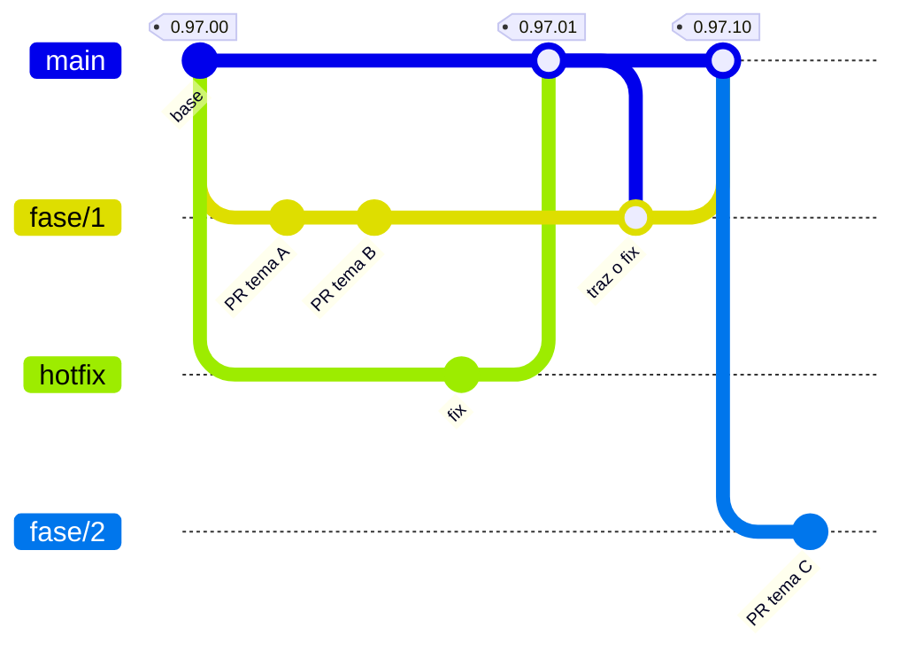

# Mu Online 0.97k — reconstrução do código-fonte

[](https://mu-linux.com/es/)

[🇪🇸 Español](README.md) | [🇺🇸 English](README.en.md) | 🇧🇷 Português

Port em C++ do cliente **Mu Online 0.97k** (`main.exe`, MD5
`eb95ac0785e40a7ad60c9ddb5d8bef34`), reconstruído por engenharia reversa a
partir do binário original.

O objetivo é que o cliente compilado **se comporte igual ao binário original**:
mesmo fluxo de login, mesmo render, mesmos pacotes. Não é uma reescrita nem um
"cliente inspirado em" — cada função é um port da sua contraparte no binário, e
os desvios deliberados estão documentados em um comentário ao lado do código.

**O código e os comentários estão em espanhol.** Os símbolos que já puderam ser
identificados são nomeados por responsabilidade; a definição canônica de cada um
mantém um comentário `IDA: FUN_xxxxxxxx` ou `IDA: DAT_xxxxxxxx` para preservar a
rastreabilidade com o binário.

---

## Estado

**Funciona de ponta a ponta**: inicia, conecta, faz login, escolhe personagem,
entra no mundo e é jogável. Terreno, personagens, inventário, equipamento, chat,
party, guild, loja, baú, combate básico e efeitos estão operacionais.

Não é um cliente finalizado: ainda há subsistemas com lacunas conhecidas, e bugs
de port continuam aparecendo conforme novos caminhos são exercitados. A parte
mais incompleta hoje é a movimentação de NPCs e monstros.

### Por subsistema

| Subsistema | Estado |
|---|---|
| Inicialização, janela, OpenGL | Completo |
| Login + seleção de servidor (inclui o fluxo ConnectServer) | Completo, verificado contra servidor real |
| Seleção de personagem | Funcional |
| Rede / protocolo (85+ opcodes) | Completo no que foi exercitado; opcodes novos aparecem ao usar features novas |
| Terreno, iluminação, água | Completo |
| Render de personagens e equipamento | Funcional |
| Efeitos, joints, partículas, clima | Funcional |
| Inventário, equipamento, baú, loja, trade | Funcional |
| Chat, party, guild | Funcional |
| Som (DirectSound) | Funcional |
| Música (BGM) | o original executa `MuPlayer.exe` |
| Textos e idioma | UI em espanhol. O port abre `Text.bmd` fixo, que aqui é a variante `_Spn`; as variantes `_Eng`/`_Por` vêm em `Data/Local/`, mas o seletor de idioma vem da DLL e não está portado |
| Combate | `Attack`, `Action` e `MoveCharacterVisual` auditadas 1:1 contra o IDA, junto com suas cadeias de executores |
| Movimentação de NPCs / monstros | Parcial |

> **Enquanto o seletor não estiver portado**, para jogar em outro idioma basta
> substituir os arquivos base em `bin/Client/Data/Local/` pela variante que você
> quiser: copiar `Text_Por.bmd` sobre `Text.bmd` e `Dialog_Por.bmd` sobre
> `Dialog.bmd` (ou os `_Eng`). Guarde uma cópia dos originais antes. Os nomes de
> itens, skills e quests **já estão em inglês** e não têm variante, então esses
> não mudam de qualquer forma.

### Arquitetura e dívida técnica

O código portado está distribuído por domínio (`Render/`, `Terrain/`, `UI/`,
`Item/`, `Entity/`, `Combat/`, `Net/`, `Scene/`, etc.); já não existe um
depósito geral de `stubs_*.cpp` esperando ser distribuído. A árvore atual tem
249 arquivos `.cpp` e 58 headers em `src/`.

Os decompilados crus do IDA que nunca foram ativados (antes em
`src/stubs_IDA_ports.cpp`) estão arquivados em `docs/codigo-muerto/`, fora do
build, como referência do decompile. Os aliases e bridges de ABI que restam em
`functions.h`/`globals.h` não são dívida de nomenclatura: mantêm o contrato
original dos ports que os usam.

Os `FUN_*` e `DAT_*` que ainda aparecem no código não são, por si sós,
dívida de renomeação. Alguns descrevem infraestrutura, CRT, GameGuard, layouts
binários, pools ou compatibilidade; outros precisam de investigação ou de um
port futuro antes de receber um nome semântico seguro.

---

## O que você precisa além deste repo

Quase nada: os **assets do jogo já estão incluídos** em `bin/Client/Data/`
(~209 MB — modelos `.bmd`, texturas `.ozj`/`.ozt`, mapas, sons e música), junto
com `MuPlayer.exe`, que é o que o cliente executa para tocar o BGM. Clonar,
compilar e rodar.

O único item que **não** está incluído é o **`main.exe` original**, que só é
necessário se você quiser decompilá-lo por conta própria para verificar um port
contra o binário. Ele vem em qualquer distribuição do cliente 0.97k; confira o
MD5 (`eb95ac0785e40a7ad60c9ddb5d8bef34`) antes de comparar endereços, porque
existem muitas variantes com patch circulando e elas não coincidem.

Você também precisa de um **servidor**. O port é validado contra
[MuEmu - Linux](https://github.com/EmanuelCatania/Mu-Linux-0.97k) (season
0.97k), que é a fonte autoritativa para o formato dos pacotes. A versão de
Windows [MuEmu - Kayito](https://github.com/nicomuratona/MuEmu-0.97k-kayito)
(season 0.97k) também pode ser usada.

---

## Compilar

Requer **Visual Studio 2022** com o toolset de C++ para desktop.

1. Abrir `mu97k.sln`.
2. Selecionar a configuração **Debug** / plataforma **Win32**.
3. Compilar.

**A plataforma tem que ser Win32 (x86).** Todo o port assume ponteiros de 32
bits: os endereços do binário original, os layouts de struct e os pools de
memória. Em x64 não compila, e se compilasse não funcionaria.

Saída: `bin/Client/main.exe`. O projeto linka direto em `bin/Client/`, que é
onde ficam os assets e o `server.cfg`, então não há cópia intermediária nem
risco de acabar executando um binário antigo.

Bibliotecas linkadas (todas do SDK do Windows, exceto a libjpeg, que vem
incluída): `opengl32.lib`, `glu32.lib`, `winmm.lib`, `ws2_32.lib`.

### Executar

1. Copiar `server.cfg.example` para `bin/Client/server.cfg` e editar (é o único
   arquivo que não vem no repo).
2. Executar `bin/Client/main.exe`.

#### `server.cfg`

Dois tipos de linha: os endereços (`<IP> <porta>`) e as de identidade do
servidor (`chave=valor`). As que começam com `#` ou `;` são comentários.

```
127.0.0.1 44405        <- ConnectServer (lista de servidores + barra de carga)
127.0.0.1 55901        <- GameServer (fallback)

CustomerName=MuLinux
ServerSerial=TbYehR2hFUPBKgZj
ClientVersion=0.97.11
```

**Endereços.** Com duas linhas usa-se o fluxo ConnectServer: o cliente pede a
lista real (`F4/02`), o servidor responde com nomes e ocupação, e ao escolher um
o `F4/03` redireciona para o GameServer. Com **uma única linha** conecta direto
ao GameServer — o comportamento clássico, e nesse caso a tela de seleção de
servidor mostra uma entrada estática de preenchimento.

> A tela de seleção de servidor aparece **sempre**, mesmo apontando direto para
> o GameServer: é uma tela do fluxo original, não um indício de que você está
> chegando ao ConnectServer.

**Identidade do servidor.** Os três valores precisam coincidir com os do
GameServer (`MuServer/GameServer/DATA/GameServerInfo - StartUp.dat`). Se algum
não coincidir, o cliente **conecta mas não entra**, e sem nenhuma mensagem útil:

| Chave | De onde sai | O que acontece se não coincidir |
|---|---|---|
| `CustomerName` | `CustomerName=` do `.dat` | O cliente conecta, descriptografa lixo e fica travado em *"conectando ao GameServer"* para sempre |
| `ServerSerial` | `ServerSerial=` do `.dat` | Igual ao de cima, **e além disso** o login retorna *"versão incorreta"* |
| `ClientVersion` | `ServerVersion=` do mesmo `.dat` | Login rejeitado com *"versão incorreta"* |

`CustomerName` e `ServerSerial` alimentam a chave de criptografia, que o
GameServer deriva da combinação dos dois
(`GameServer/HackCheck.cpp::InitHackCheck`); é por isso que mudar o nome do
cliente quebra a conexão mesmo com todo o resto correto. `ServerSerial` cumpre
duas funções: entra nessa derivação e o servidor ainda o compara byte a byte no
login.

Se forem omitidos, usam-se os valores padrão deste fork (os do bloco acima).
`ClientVersion` aceita tanto `0.97.11` quanto `09711`.

**Para diagnosticar**, `bin/Client/debug.log` registra a chave derivada na
inicialização:

```
MuEmu: InitKeys CustomerName='MuLinux' Serial='TbYehR2hFUPBKgZj' -> EncDecKey1=0xC2 EncDecKey2=0x01 (xor=0xC2 add=0xC2)
server.cfg: ClientVersion='09711'
```

Se o cliente travar conectando, essa linha é a primeira coisa a olhar: compare
com o `CustomerName` do servidor.

**Opções do cliente.** O 0.97k lê estas do registro do Windows, que é onde o
launcher oficial as deixa. Aqui não há launcher, então também são aceitas no
`server.cfg` e, quando presentes, ganham do registro — a ideia é poder
distribuir o cliente já configurado. São aceitas como `0`/`1` ou `on`/`off`, e o
que foi aplicado fica em `debug.log`; um valor inválido é ignorado e registrado
como `IGNORADO`.

| Chave | Padrão do binário | Observações |
|---|---|---|
| `MusicOnOff` | `0` (desligada) | O `server.cfg.example` traz em `1`. Se você comentar, não vai ouvir BGM e isso **não é bug**: é o padrão original. O cliente não decodifica o mp3, ele executa `MuPlayer.exe` (incluído em `bin/Client/`). |
| `SoundOnOff` | `1` | Efeitos sonoros (DirectSound). |
| `Resolution` | `0` (640x480) | Índice `0..4` ou `LARGURAxALTURA`, mas **somente as cinco do binário**: 640x480, 800x600, 1024x768, 1280x1024, 1600x1200. Qualquer outra é ignorada e o cliente inicia em 640x480. |
| `WindowMode` | — (desvio) | `1` = em janela, `0` = tela cheia. Portado da DLL de injeção: o 0.97k só roda em tela cheia e procura um modo de vídeo de 16 bits de cor que não existe no Windows 10/11, então a troca de modo falha em silêncio e a janela fica sem bordas num canto. |
| `Borderless` | — (desvio) | `1` = sem barra de título nem borda. Só se aplica no modo janela. |

Para adicionar uma resolução que não esteja entre essas cinco é preciso mexer em
dois lugares de `src/Config/Config_Load.cpp`: o parser de `Resolution`, que mapeia
`LARGURAxALTURA` para o índice, e o `switch` da seção 5, que é o que escreve
`WindowWidth`/`WindowHeight`. Isso basta para o render escalar — as escalas de
layout (`g_fScreenRate_x/y`) derivam dessas duas variáveis — mas nada do cliente
foi testado fora das cinco originais, então uma resolução ampla pode expor
problemas nos painéis e nos hit-tests.

---

## Estrutura

```
mu97k-src/
├── mu97k.sln            solução do VS2022
├── mu97k.vcxproj        projeto (Win32)
├── lib/libjpeg/         libjpeg 6b (decodifica as texturas .ozj)
└── src/
    ├── WinMain.cpp      ponto de entrada + WndProc + loop de mensagens
    ├── globals.{h,cpp}  estado global; os DAT identificados mantêm rastreabilidade IDA
    ├── functions.h      declarações compartilhadas e procedência IDA dos símbolos renomeados
    ├── structs.h        layouts de struct verificados contra o IDA
    ├── ghidra_compat.h  macros que o decompile do Ghidra pressupõe existentes
    │                    (qmemcpy, LODWORD, SLOBYTE, ...)
    │
    ├── Combat/  Config/  Core/    Entity/  Game/     GameGuard/ Input/ Item/
    ├── Local/   Math/    Model/   Monster/ Net/       Party/     Path/  Physics/
    └── Render/  Scene/   Sound/   Terrain/ Trade/     UI/        Util/
```

Os módulos agrupam por responsabilidade. O endereço no binário continua sendo
uma pista importante para verificar uma função ou resolver um símbolo, mas não
determina onde o código portado fica.

---

## Como trabalhar nisso

### A regra principal: fiel ao binário

A ordem de autoridade para resolver qualquer dúvida:

1. **IDA / o binário original.** É a verdade. Se o decompile disser algo
   estranho, provavelmente o decompile está certo e a nossa intuição não.
2. **O servidor MuEmu**, para tudo que seja formato de pacotes.
3. **A DLL de injeção**, como segunda referência de comportamento.
4. **O source do Mu Online 5.2**, apenas como apoio semântico e de nomenclatura
   quando o contexto atual permitir. Não se copia implementação nem se
   incorpora comportamento do 5.2: a UI, as definições e as features podem
   diferir do 0.97k.

O que não está em nenhuma dessas fontes não se inventa. Se um desvio for
necessário (porque um caminho do original é inalcançável, ou depende de algo
que ainda não foi portado), ele é implementado **e documentado em um comentário
ali mesmo**, explicando o que o original faz e por que nos afastamos.

A única coisa deliberadamente ignorada é o ruído anti-tamper: as operações de
hash-table intercaladas, os blocos inalcançáveis e o scrambling XOR da versão
protegida. Nada disso é lógica de jogo.

### Armadilhas conhecidas

Estas custaram sessões inteiras de depuração. Todas voltaram a aparecer mais de
uma vez.

**1. Símbolos duplicados.** O mesmo nome definido duas vezes: um stub antigo e o
port real. C++ pode aceitar isso como sobrecarga se as assinaturas diferirem, e
então cada chamador resolve para uma cópia diferente. Sintoma típico: um valor é
corrompido e não aparece nenhum escritor que explique. Antes de auditar qualquer
função, confirme que você está lendo **a cópia que compila** — não uma dentro de
`#if 0`, nem uma atrás de uma macro `IDA_PORT_*` sem definição. Corolário: uma
sonda de diagnóstico colocada em código morto devolve zero resultados, e esse
silêncio parece evidência de que não há bug.

**2. Locais que o Ghidra separou.** O decompile emite como variáveis soltas o que
no frame original era um bloco contíguo, e o código as percorre como se ainda
fossem (`&local_XX` de um escalar passado como `vec3`). O compilador não garante
esse layout. Sintoma: a primeira componente sai certa e o resto é lixo (valores
de ~1e9). Corrige-se reconstruindo o frame como um único array contíguo e
mapeando os nomes por offset.

**3. Campos inteiros lidos como float.** O Ghidra tipa o slot como `float*` e
então *todo* acesso sai como float, incluindo os campos que são inteiros ou
ponteiros. `(float)(uintptr_t)ptr` converte numericamente o que deveria ser
reinterpretado por bits. Sintoma: não é um crash, é funcionalidade que
simplesmente não acontece — comparações que nunca dão verdadeiro, ponteiros em
zero, contadores travados. Pista: valores de ~1e9 que, lidos como bits, dão
floats pequenos e razoáveis. Dentro de um mesmo arquivo costumam conviver
acessos corretos e quebrados; essa mistura é o sinal.

**4. Padding de structs nos pacotes.** O servidor envia structs de C com o
padding de alinhamento. Ler os campos no offset "lógico" em vez do real devolve
lixo convincente. Já morderam nos stats, na lista de guild e nos números de
dano.

**5. Os rótulos dos offsets mentem.** Vários campos da struct de entidade
ficaram mal rotulados por meses (`+0x1BC` não são flags de movimento: é a classe
do personagem; `+0x34E` não é "morto": é SafeZone). Antes de confiar no nome de
um offset, procure quem o **escreve** no binário.

**6. Nomes de função parecidos com efeitos opostos.** O caso recorrente é a
família de estado do OpenGL: `EnableAlphaTest` (0x511680), `EnableAlphaBlend`
(0x511710, aditivo) e `DisableTexture` (0x511590, que desliga a texturização).
Confundi-las pinta quadrados brancos sobre meio frame, porque o estado do GL
fica preso e contamina tudo o que for desenhado depois.

**7. Limites e limpezas inventados.** Guards que o binário não tem e que, em vez
de recortar, **descartam a entrada inteira**. Apareceu dos dois lados: nos
handlers de rede (`count > 30` jogava fora os 41 monstros de um viewport; o
sintoma se lia como bug de spawn, com uma cascata de `key not found` no log) e
no tick de input (um `else` que, ao bloquear o debounce, fazia
`MouseLButtonPush = 0; MouseLButton = 0;`, ou seja, perdia o clique: era preciso
clicar várias vezes para andar). Regra: qualquer `= 0` ou `clear` que o port
adicione no caminho de *"ainda não dá"* é suspeito — o binário quase sempre
deixa o estado pendente para o próximo tick.

### Desvios de protocolo

Estão documentados no código, mas vale conhecê-los se você apontar o cliente
para outro servidor:

- **`C3:1E` (duration skill) é enviado com 11 bytes, não 9.** O 0.97k vanilla
  não inclui `index[]`, mas o `CGDurationSkillAttackRecv` do MuEmu sempre o lê
  (`SkillManager.cpp:2047`): com 9 bytes o servidor pega esses dois bytes de
  fora do pacote e a skill acerta outra entidade. A DLL de injeção faz o mesmo
  (`CPatchs::SendRequestMagicContinue`).
- **Triple Shot envia o byte `angle`.** O servidor monta o cone com `angle`, não
  com `dir` (`SkillManager.cpp:1185`).
- **F3/12 ao entrar no mundo.** Sem esse ACK o servidor deixa `RegenOk` em 1 e
  rejeita todo `/move` posterior, além de não enviar as entidades do mapa.

---

## Licença

MIT — ver [LICENSE](LICENSE).

A licença cobre **o código**: tudo que está em `src/`.

**Não** cobre os assets de `bin/Client/Data/` nem o `MuPlayer.exe`, que são
copyright da WebZen Inc. e estão no repo apenas porque ele é privado e de uso
interno entre colaboradores.

`lib/libjpeg/jpeg-6b` é do Independent JPEG Group, sob a própria licença
permissiva (`lib/libjpeg/jpeg-6b/README`, seção "LEGAL ISSUES").

---

## Roteiro

A tag `0.97.00` encerra a etapa de reconstrução fiel: o cliente se comporta como o
binário original. A partir daí o trabalho segue por fases, e cada fase encerrada é uma
versão.



Os números de cada fase são a versão prevista ao encerrá-la; o escopo de cada uma
pode ser ajustado no caminho.

### Versionamento

As versões são `0.97.FH`, sempre com dois dígitos: **F** é a fase e **H** o
hotfix.

| Tag | O que é |
|---|---|
| `0.97.00` | base da reconstrução fiel |
| `0.97.01`, `0.97.02`… | correções sobre a base |
| `0.97.10` | encerramento da Fase 1 |
| `0.97.11`, `0.97.12`… | correções sobre a Fase 1 |
| `0.97.20` | encerramento da Fase 2, e assim por diante |

O cliente e o [server](https://github.com/EmanuelCatania/Mu-Linux-0.97k) usam a
mesma numeração: a mesma tag nos dois repositórios indica que funcionam juntos. Cada
Season terá sua própria linha (`0.99.FH`, …).

### Branches



- `main` só recebe encerramentos de fase e correções; cada merge leva sua tag e sua
  Release.
- Cada fase é trabalhada em `fase/N`. As branches de tema (`fix/…`, `feat/…`, `chore/…`)
  saem de `fase/N` e voltam por PR.
- Uma correção sobre uma versão publicada sai da tag afetada, é mergeada em `main`
  com sua nova tag e também na fase em andamento.
- As Releases publicam só o código-fonte: cada uma compila o cliente com os dados
  do seu server.
