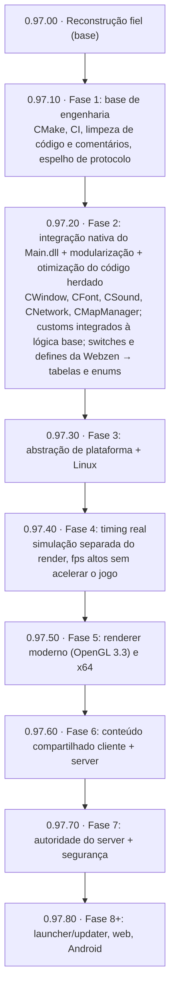
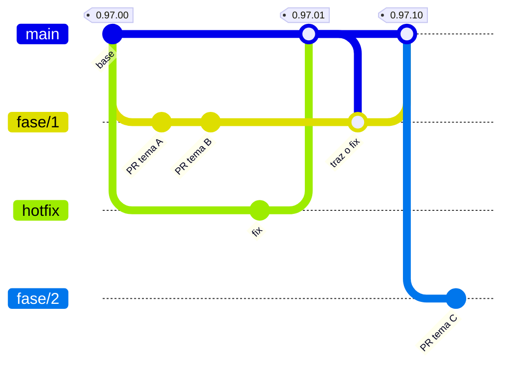

# Mu Online 0.97k — reconstrução do código-fonte

[](https://mu-linux.com/es/)

[🇪🇸 Español](README.md) | [🇺🇸 English](README.en.md) | 🇧🇷 Português

Port em C++ do cliente **Mu Online 0.97k** (`main.exe`, MD5
`eb95ac0785e40a7ad60c9ddb5d8bef34`), reconstruído por engenharia reversa a
partir do binário original.

O objetivo é que o cliente compilado **se comporte igual ao binário original**:
mesmo fluxo de login, mesmo render, mesmos pacotes. Não é uma reescrita nem um
"cliente inspirado em" — cada função é um port da sua contraparte no binário, e
os desvios deliberados estão documentados em um comentário ao lado do código.

**O código e os comentários estão em espanhol.** Os símbolos que já puderam ser
identificados são nomeados por responsabilidade; a definição canônica de cada um
mantém um comentário `IDA: FUN_xxxxxxxx` ou `IDA: DAT_xxxxxxxx` para preservar a
rastreabilidade com o binário.

---

## Estado

**Funciona de ponta a ponta**: inicia, conecta, faz login, escolhe personagem,
entra no mundo e é jogável. Terreno, personagens, inventário, equipamento, chat,
party, guild, loja, baú, combate básico e efeitos estão operacionais.

Não é um cliente finalizado: ainda há subsistemas com lacunas conhecidas, e bugs
de port continuam aparecendo conforme novos caminhos são exercitados. A parte
mais incompleta hoje é a movimentação de NPCs e monstros.

### Por subsistema

| Subsistema | Estado |
|---|---|
| Inicialização, janela, OpenGL | Completo |
| Login + seleção de servidor (inclui o fluxo ConnectServer) | Completo, verificado contra servidor real |
| Seleção de personagem | Funcional |
| Rede / protocolo (85+ opcodes) | Completo no que foi exercitado; opcodes novos aparecem ao usar features novas |
| Terreno, iluminação, água | Completo |
| Render de personagens e equipamento | Funcional |
| Efeitos, joints, partículas, clima | Funcional |
| Inventário, equipamento, baú, loja, trade | Funcional |
| Chat, party, guild | Funcional |
| Som (DirectSound) | Funcional |
| Música (BGM) | Completo: tocada pelo miniaudio dentro do cliente; aceita mp3, wav e flac (o original executava `MuPlayer.exe`) |
| Textos e idioma | UI em espanhol. O port abre `Text.bmd` fixo, que aqui é a variante `_Spn`; as variantes `_Eng`/`_Por` vêm em `Data/Local/`, mas o seletor de idioma vem da DLL e não está portado |
| Combate | `Attack`, `Action` e `MoveCharacterVisual` auditadas 1:1 contra o IDA, junto com suas cadeias de executores |
| Movimentação de NPCs / monstros | Parcial |

> **Enquanto o seletor não estiver portado**, para jogar em outro idioma basta
> substituir os arquivos base em `bin/Client/Data/Local/` pela variante que você
> quiser: copiar `Text_Por.bmd` sobre `Text.bmd` e `Dialog_Por.bmd` sobre
> `Dialog.bmd` (ou os `_Eng`). Guarde uma cópia dos originais antes. Os nomes de
> itens, skills e quests **já estão em inglês** e não têm variante, então esses
> não mudam de qualquer forma.

### Arquitetura e dívida técnica

O código portado está distribuído por domínio (`Render/`, `Terrain/`, `UI/`,
`Item/`, `Entity/`, `Combat/`, `Net/`, `Scene/`, etc.); já não existe um
depósito geral de `stubs_*.cpp` esperando ser distribuído. A árvore atual tem
249 arquivos `.cpp` e 58 headers em `src/`.

Os decompilados crus do IDA que nunca foram ativados (antes em
`src/stubs_IDA_ports.cpp`) estão arquivados em `docs/codigo-muerto/`, fora do
build, como referência do decompile. Os aliases e bridges de ABI que restam em
`functions.h`/`globals.h` não são dívida de nomenclatura: mantêm o contrato
original dos ports que os usam.

Os `FUN_*` e `DAT_*` que ainda aparecem no código não são, por si sós,
dívida de renomeação. Alguns descrevem infraestrutura, CRT, GameGuard, layouts
binários, pools ou compatibilidade; outros precisam de investigação ou de um
port futuro antes de receber um nome semântico seguro.

---

## O que você precisa além deste repo

Quase nada: os **assets do jogo já estão incluídos** em `bin/Client/Data/`
(~209 MB — modelos `.bmd`, texturas `.ozj`/`.ozt`, mapas, sons e música).
Clonar, compilar e rodar.

O único item que **não** está incluído é o **`main.exe` original**, que só é
necessário se você quiser decompilá-lo por conta própria para verificar um port
contra o binário. Ele vem em qualquer distribuição do cliente 0.97k; confira o
MD5 (`eb95ac0785e40a7ad60c9ddb5d8bef34`) antes de comparar endereços, porque
existem muitas variantes com patch circulando e elas não coincidem.

Você também precisa de um **servidor**. O port é validado contra
[MuEmu - Linux](https://github.com/EmanuelCatania/Mu-Linux-0.97k) (season
0.97k), que é a fonte autoritativa para o formato dos pacotes. A versão de
Windows [MuEmu - Kayito](https://github.com/nicomuratona/MuEmu-0.97k-kayito)
(season 0.97k) também pode ser usada.

---

## Compilar

Requer o **Visual Studio 2022** com o toolset de C++ para desktop (ele já traz o
CMake). Há duas formas equivalentes, que geram o mesmo exe:

- **Visual Studio:** abrir `mu97k.sln`, escolher **Debug** ou **Release** com a
  plataforma **Win32** e compilar.
- **CMake:**
  ```
  cmake -S . -B build -A Win32 -T v143
  cmake --build build --config Release
  ```
  O primeiro comando também gera `build/mu97k.sln`, caso você queira continuar
  no Visual Studio com as pastas de `src/` como filtros.

Enquanto os dois convivem, um `.cpp` novo entra no `.vcxproj` **e** no
`CMakeLists.txt`; a CI falha se as duas listas não baterem.

**A plataforma tem que ser Win32 (x86).** Todo o port assume ponteiros de 32
bits: os endereços do binário original, os layouts de struct e os pools de
memória. Em x64 não compila, e se compilasse não serviria.

Saída: `bin/Client/main.exe`. O projeto linka direto em `bin/Client/`, que é
onde ficam os assets e o `Config.ini`, então não há cópia intermediária nem
risco de acabar executando um binário velho.

Bibliotecas linkadas (todas do SDK do Windows, exceto a libjpeg, que vem
incluída): `opengl32.lib`, `glu32.lib`, `winmm.lib`, `ws2_32.lib`.

### Apontar para o seu servidor

O endereço e a identidade do servidor ficam **compilados no cliente**, como no
MU 5.2: não há arquivo de configuração para distribuir. Eles ficam em
`src/Config/ServerConfig.h` e apontam para o servidor de referência do projeto;
para usar o seu, edite esse arquivo e recompile.

O endereço pode ser um IP ou um nome de host (o cliente resolve por DNS, como o
original). Um nome é melhor: não fica um IP público fixo no código e o servidor
pode mudar sem recompilar. Se o domínio estiver na Cloudflare, o registro tem
que ficar **sem proxy** ("DNS only"): o proxy só deixa passar tráfego web e
corta as conexões do jogo.

```cpp
constexpr char           ConnectServerIP[]   = "mu.server-pups.space";
constexpr unsigned short ConnectServerPort   = 44405;   // 0 = sem ConnectServer
constexpr char           GameServerIP[]      = "mu.server-pups.space";
constexpr unsigned short GameServerPort      = 55901;
constexpr char           CustomerName[]      = "MuLinux";
constexpr char           ServerSerial[]      = "TbYehR2hFUPBKgZj";
constexpr char           ClientVersion[]     = "0.97.11";
```

**Endereços.** Com `ConnectServerPort` diferente de 0 é usado o fluxo do
ConnectServer: o cliente pede a lista real (`F4/02`), o servidor responde com
nomes e ocupação, e ao escolher um o `F4/03` redireciona para o GameServer; se o
ConnectServer não responder, conecta no GameServer. Com `0` conecta direto no
GameServer e o select-server mostra uma entrada fixa.

> O select-server aparece **sempre**, mesmo apontando direto para o GameServer:
> é uma tela do fluxo original, não um sinal de que você está chegando ao
> ConnectServer.

**Identidade do servidor.** Os três valores têm que coincidir com os do
GameServer (`MuServer/GameServer/DATA/GameServerInfo - StartUp.dat`). Se algum
não coincidir, o cliente **conecta mas não entra**, sem nenhuma mensagem útil:

| Valor | De onde vem | O que acontece se não coincidir |
|---|---|---|
| `CustomerName` | `CustomerName=` do `.dat` | O cliente conecta, descriptografa lixo e fica em *"conectando ao GameServer"* para sempre |
| `ServerSerial` | `ServerSerial=` do `.dat` | Igual ao de cima, **e além disso** o login devolve *"versão incorreta"* |
| `ClientVersion` | `ServerVersion=` do `.dat` | Login recusado com *"versão incorreta"* |

`CustomerName` e `ServerSerial` alimentam a chave de criptografia, que o
GameServer deriva dos dois combinados (`GameServer/HackCheck.cpp::InitHackCheck`).
`ServerSerial` tem dupla função: entra nessa derivação e o servidor também o
compara byte a byte no login. `ClientVersion` aceita `0.97.11` ou `09711`.

**Para diagnosticar**, o `bin/Client/debug.log` registra ao iniciar o endereço
usado e a chave derivada:

```
ServerConfig: ConnectServer=mu.server-pups.space:44405 GameServer=mu.server-pups.space:55901 version='09711'
MuEmu: InitKeys CustomerName='MuLinux' Serial='TbYehR2hFUPBKgZj' -> EncDecKey1=0xC2 EncDecKey2=0x01 (xor=0xC2 add=0xC2)
```

Se o cliente travar conectando, essa linha é a primeira coisa a olhar: compare
com o `CustomerName` do servidor.

### Executar e opções do jogador

Executar `bin/Client/main.exe`.

As preferências do jogador são lidas de **`bin/Client/Config.ini`**, com as
mesmas seções e chaves que o `Main.dll` de injeção usava, então o `Config.ini`
que você já tem serve. O 0.97k original as lia do registro do Windows, onde o
launcher oficial as deixava: se uma chave não está no `Config.ini`, vale o
registro, e se também não estiver lá, o padrão do binário. O que foi aplicado
fica no `debug.log` (linha `Config.ini: ...`).

| Chave | Padrão do binário | Notas |
|---|---|---|
| `[Window] WindowMode` | — (desvio) | `1` = em janela, `0` = tela cheia. O 0.97k só roda em tela cheia e procura um modo de vídeo de 16 bits que não existe no Windows 10/11. |
| `[Window] Borderless` | — (desvio) | `1` = sem barra de título nem borda. Só vale em modo janela. |
| `[Window] Resolution` | `0` (640x480) | Índices do DLL: `0` 640x480, `1` 800x600, `2` 1024x768, `3` 1280x1024, `4` 1280x720, `5` 1366x768, `6` 1600x900, `7` 1920x1080. Atenção: o `4` não é o mesmo do registro (lá é 1600x1200). As widescreen (`4` a `7`) ainda não foram testadas neste cliente. |
| `[Sound] EnableSound` | `1` | Efeitos sonoros (DirectSound). |
| `[Sound] EnableMusic` | `0` (desligada) | O `Config.ini` do repositório vem com `1`. Cada tema toca uma vez; o do login é `Data\Music\MuTheme.mp3`, que o pacote não traz. |
| `[Sound] SoundLevel`, `MusicLevel` | — (desvio) | Volume de efeitos e de música, de `0` (mudo) a `9` (volume original); como no DLL, cada nível são 6,25 dB. O `Config.ini` do repositório vem com `4`. |
| `[User] Username` | — | Preenche o campo de usuário do login. |
| `[Font] FontName`, `FontHeight`, `FontBold`, `FontItalic`, `FontCharset`, `FontWidth`, `FontUnderline`, `FontQuality`, `FontStrikeOut` | Arial, altura conforme a resolução | Como o DLL: altura fixa (limite 25) e a fonte grande com o dobro. O `Config.ini` do repositório vem com Verdana 13. Se a seção `[Font]` inteira for apagada, o cliente volta à fonte original. |

As seções `[Antilag]`, `[MiniMap]` e `[Language]` do `Config.ini` do
DLL vão ser lidas conforme esses sistemas forem integrados (Fase 2 do roteiro).

---

## Como adicionar itens custom

Com o `Main.dll` de injeção, um item custom era adicionado dos dois lados: o
server o definia no seu `Item.txt`, e o cliente precisava de um `item.bmd`
regerado mais os `.txt` do `Encoder` (`CustomItem.txt`, `CustomGlow.txt`, etc.)
empacotados no `ClientInfo.bmd`. Se cliente e server não batiam, o item
aparecia errado ou o server o rejeitava.

Agora **o server é a única fonte**. No login ele manda ao cliente um catálogo
com todas as definições (itens, monstros, efeitos, pets). O cliente **só
precisa dos arquivos do modelo** (`.bmd` e texturas) dentro de
`bin/Client/Data`. Não é preciso regerar o `item.bmd` nem mexer no código.

Os `.txt` do `Encoder` do DLL continuam sendo lidos de `Data/Custom/Encoder`
do server, então uma pasta de customs feita para o DLL funciona sem converter
nada.

### Índices: a faixa clássica e a estendida

No 0.97k cada seção de itens (espadas, machados, …, joias) tem **32 índices**
(0 a 31). Além disso, cada seção aceita índices **32 a 511**: são os itens
*adicionados*. No protocolo eles usam 13 bits (o item ocupa 7 bytes em vez de
5), então nunca colidem com um item vanilla.

Um item adicionado precisa dizer **qual item vanilla ele imita** (coluna
*Comportamento*): isso decide a lógica que o 0.97k tem escrita por tipo de item
(se é um arco e gasta flechas, se é uma asa, uma joia, quais opções excellent
pode ter). Todo o resto —nome, stats, tamanho, modelo, brilho, efeitos— vem da
sua própria linha.

### Exemplo 1: a Knight Blade, do jeito do DLL

O item fica dentro da faixa clássica (`0,20`); modelo e brilho são definidos no
`Encoder`:

```
// Data/Custom/Encoder/CustomItem.txt
00,020		22		"Sword21"		// Knight Blade

// Data/Custom/Encoder/CustomGlow.txt
00,020		191	165	127		// Knight Blade
```

Assets no cliente: `bin/Client/Data/Item/Custom/20/` (`sword21.bmd` e suas
texturas).

### Exemplo 2: a Crimson Knight Blade, fora da faixa clássica

O mesmo modelo como item adicionado (`0,32`), tudo em uma linha de
`Data/Item/Item.txt`. Depois das colunas de sempre vêm: comportamento, pasta e
nome do modelo, e a cor do brilho (RGB):

```
32	0	22	1	4	1	1	0	"Crimson Knight Blade"	...	00,020	"Item\Custom\20\"	"Sword21"	255	40	40
```

Se comporta como a Knight Blade (`00,020`), usa o modelo `Sword21` e brilha em
vermelho. Comando de teste: `/make 0 32`.

### Exemplo 3: o set Great Dragon

Cinco peças no índice `21` das seções 7 a 11, com o modelo definido no
`CustomItem.txt` do `Encoder` (como no DLL):

```
07,021		0		"HelmMale22"		// Great Dragon Helm
08,021		0		"ArmorMale22"		// Great Dragon Armor
09,021		0		"PantMale22"		// Great Dragon Pant
10,021		0		"GloveMale22"		// Great Dragon Glove
11,021		0		"BootMale22"		// Great Dragon Boot
```

Assets no cliente: `bin/Client/Data/Player/Custom/21/`. As mesmas peças também
podem ser definidas sem o `Encoder`, com as colunas de modelo no `Item.txt`
(`"Player\Custom\21\" "HelmMale22"`).

### Exemplo 4: efeitos próprios e pose no inventário

`Data/Custom/Items/<seção>_<índice>.json` dá a um item (custom ou vanilla) sua
pose no inventário e efeitos que o cliente desenha sobre os ossos do modelo.
Por exemplo, asas com os brilhos das Wings of Illusion do 5.2:

```json
{
  "item": "12,032",
  "effects": [
    { "on": "equipped", "type": "sprite", "texture": "Effect/Flare.jpg",
      "bones": [5, 6, 7, 8, 18, 19], "color": [0.5, 0.0, 0.0], "scale": 0.6,
      "pulse": { "speed": 0.002, "scale": 0.2, "color": 0.4 } },
    { "on": "equipped", "type": "particle", "particle": 1230,
      "bones": [13, 31], "chance": 2, "color": [0.8, 0.8, 0.3], "scale": 0.5 }
  ]
}
```

No repo do server há um caso real: `Data/Custom/Items/03_000.json` corrige a
posição da Light Spear (vanilla) na sua casa do inventário, com a correção do
5.2.

### Exemplo 5: um pet custom (Pet Rudolph)

O Rudolph do 5.2 como pet que dá voltas ao redor do jogador e pega o zen
próximo. Ele usa um índice alto (`13,400`) de propósito, como exemplo da faixa
estendida. São quatro arquivos, todos incluídos nos repos:

| Onde | Arquivo | O que define |
|---|---|---|
| cliente | `bin/Client/Data/Item/Custom/Rudolph/` | o modelo `xmas_deer.bmd` e suas texturas |
| server | `Data/Item/Item.txt` | a linha do item: `Slot` 8 (helper), comportamento `*` (não imita nenhum pet vanilla) e o modelo |
| server | `Data/Custom/Items/13_400.json` | a pose no inventário |
| server | `Data/Custom/Pets/13_400.json` | como se move e o que faz |

```json
{
  "item": "13,400",
  "blendMesh": 0,
  "movement": { "type": "orbit", "radius": 50, "period": 4000, "height": 20 },
  "abilities": [ { "type": "pickup", "what": "zen", "range": 3, "interval": 1000, "delay": 1500 } ]
}
```

O cliente desenha o movimento; as habilidades (pegar o zen) são executadas pelo
server, que é quem decide. Comando de teste: `/make 13 400`.

### Exemplo 6: um monstro custom (Karane)

Do jeito do DLL, com `Data/Custom/Encoder/CustomMonster.txt` (índice, tipo
`0`=NPC `1`=monstro, dourado, escala, pasta e modelo):

```
152		1		1		2.0		"Monster\\Karane\\"		"Karane"		// Karane
```

Ou direto no `Data/Monster/Monster.txt`, com as mesmas colunas no fim da linha
do monstro:

```
152	0	"Karane"	...	0	0	1	1	2.0	"Monster\Karane\"	"Karane"
```

Assets no cliente: `bin/Client/Data/Monster/Karane/`.

### Referência

Colunas opcionais no fim de cada linha do `Item.txt` (`*` = sem valor):

| Coluna | Exemplo | O que faz |
|---|---|---|
| Comportamento | `00,020` | item vanilla que imita na lógica |
| Pasta e modelo | `"Item\Custom\20\" "Sword21"` | modelo no inventário, no chão e no personagem |
| Brilho | `255 40 40` | cor do brilho por nível |
| Pasta e modelo equipado | `"Item\Custom\FenrirMount\" "fenril_black"` | só se o item aparece diferente equipado (uma montaria) |
| Gate | `22` | para pergaminhos: leva sempre a esse gate |

Os JSON de `Data/Custom/Items` também aceitam `"tooltip"`: até 6 linhas
próprias abaixo do nome do item, como texto (`"Zen picker"`) ou com cor
(`{ "text": "Zen picker", "color": "gold" }`; cores: `white`, `blue`, `red`,
`gold`, `green`, `darkred`, `purple`, `darkblue`, `darkgold`).

Para asas custom, `Data/Item/CustomWing.txt` adiciona as constantes de defesa e
dano. Os JSON de `Data/Custom/Items` e `Data/Custom/Pets` são validados quando o
server inicia: um arquivo com erros é descartado inteiro e o motivo vai para o
`GameServer/LOG`.

---

## Estrutura

```
mu97k-src/
├── mu97k.sln            solução do VS2022
├── mu97k.vcxproj        projeto (Win32)
├── lib/libjpeg/         libjpeg 6b (decodifica as texturas .ozj)
└── src/
    ├── WinMain.cpp      ponto de entrada + WndProc + loop de mensagens
    ├── globals.{h,cpp}  estado global; os DAT identificados mantêm rastreabilidade IDA
    ├── functions.h      declarações compartilhadas e procedência IDA dos símbolos renomeados
    ├── structs.h        layouts de struct verificados contra o IDA
    ├── ghidra_compat.h  macros que o decompile do Ghidra pressupõe existentes
    │                    (qmemcpy, LODWORD, SLOBYTE, ...)
    │
    ├── Combat/  Config/  Core/    Entity/  Game/     GameGuard/ Input/ Item/
    ├── Local/   Math/    Model/   Monster/ Net/       Party/     Path/  Physics/
    └── Render/  Scene/   Sound/   Terrain/ Trade/     UI/        Util/
```

Os módulos agrupam por responsabilidade. O endereço no binário continua sendo
uma pista importante para verificar uma função ou resolver um símbolo, mas não
determina onde o código portado fica.

---

## Como trabalhar nisso

### A regra principal: fiel ao binário

A ordem de autoridade para resolver qualquer dúvida:

1. **IDA / o binário original.** É a verdade. Se o decompile disser algo
   estranho, provavelmente o decompile está certo e a nossa intuição não.
2. **O servidor MuEmu**, para tudo que seja formato de pacotes.
3. **A DLL de injeção**, como segunda referência de comportamento.
4. **O source do Mu Online 5.2**, apenas como apoio semântico e de nomenclatura
   quando o contexto atual permitir. Não se copia implementação nem se
   incorpora comportamento do 5.2: a UI, as definições e as features podem
   diferir do 0.97k.

O que não está em nenhuma dessas fontes não se inventa. Se um desvio for
necessário (porque um caminho do original é inalcançável, ou depende de algo
que ainda não foi portado), ele é implementado **e documentado em um comentário
ali mesmo**, explicando o que o original faz e por que nos afastamos.

A única coisa deliberadamente ignorada é o ruído anti-tamper: as operações de
hash-table intercaladas, os blocos inalcançáveis e o scrambling XOR da versão
protegida. Nada disso é lógica de jogo.

### Armadilhas conhecidas

Estas custaram sessões inteiras de depuração. Todas voltaram a aparecer mais de
uma vez.

**1. Símbolos duplicados.** O mesmo nome definido duas vezes: um stub antigo e o
port real. C++ pode aceitar isso como sobrecarga se as assinaturas diferirem, e
então cada chamador resolve para uma cópia diferente. Sintoma típico: um valor é
corrompido e não aparece nenhum escritor que explique. Antes de auditar qualquer
função, confirme que você está lendo **a cópia que compila** — não uma dentro de
`#if 0`, nem uma atrás de uma macro `IDA_PORT_*` sem definição. Corolário: uma
sonda de diagnóstico colocada em código morto devolve zero resultados, e esse
silêncio parece evidência de que não há bug.

**2. Locais que o Ghidra separou.** O decompile emite como variáveis soltas o que
no frame original era um bloco contíguo, e o código as percorre como se ainda
fossem (`&local_XX` de um escalar passado como `vec3`). O compilador não garante
esse layout. Sintoma: a primeira componente sai certa e o resto é lixo (valores
de ~1e9). Corrige-se reconstruindo o frame como um único array contíguo e
mapeando os nomes por offset.

**3. Campos inteiros lidos como float.** O Ghidra tipa o slot como `float*` e
então *todo* acesso sai como float, incluindo os campos que são inteiros ou
ponteiros. `(float)(uintptr_t)ptr` converte numericamente o que deveria ser
reinterpretado por bits. Sintoma: não é um crash, é funcionalidade que
simplesmente não acontece — comparações que nunca dão verdadeiro, ponteiros em
zero, contadores travados. Pista: valores de ~1e9 que, lidos como bits, dão
floats pequenos e razoáveis. Dentro de um mesmo arquivo costumam conviver
acessos corretos e quebrados; essa mistura é o sinal.

**4. Padding de structs nos pacotes.** O servidor envia structs de C com o
padding de alinhamento. Ler os campos no offset "lógico" em vez do real devolve
lixo convincente. Já morderam nos stats, na lista de guild e nos números de
dano.

**5. Os rótulos dos offsets mentem.** Vários campos da struct de entidade
ficaram mal rotulados por meses (`+0x1BC` não são flags de movimento: é a classe
do personagem; `+0x34E` não é "morto": é SafeZone). Antes de confiar no nome de
um offset, procure quem o **escreve** no binário.

**6. Nomes de função parecidos com efeitos opostos.** O caso recorrente é a
família de estado do OpenGL: `EnableAlphaTest` (0x511680), `EnableAlphaBlend`
(0x511710, aditivo) e `DisableTexture` (0x511590, que desliga a texturização).
Confundi-las pinta quadrados brancos sobre meio frame, porque o estado do GL
fica preso e contamina tudo o que for desenhado depois.

**7. Limites e limpezas inventados.** Guards que o binário não tem e que, em vez
de recortar, **descartam a entrada inteira**. Apareceu dos dois lados: nos
handlers de rede (`count > 30` jogava fora os 41 monstros de um viewport; o
sintoma se lia como bug de spawn, com uma cascata de `key not found` no log) e
no tick de input (um `else` que, ao bloquear o debounce, fazia
`MouseLButtonPush = 0; MouseLButton = 0;`, ou seja, perdia o clique: era preciso
clicar várias vezes para andar). Regra: qualquer `= 0` ou `clear` que o port
adicione no caminho de *"ainda não dá"* é suspeito — o binário quase sempre
deixa o estado pendente para o próximo tick.

### Desvios de protocolo

Estão documentados no código, mas vale conhecê-los se você apontar o cliente
para outro servidor:

- **`C3:1E` (duration skill) é enviado com 11 bytes, não 9.** O 0.97k vanilla
  não inclui `index[]`, mas o `CGDurationSkillAttackRecv` do MuEmu sempre o lê
  (`SkillManager.cpp:2047`): com 9 bytes o servidor pega esses dois bytes de
  fora do pacote e a skill acerta outra entidade. A DLL de injeção faz o mesmo
  (`CPatchs::SendRequestMagicContinue`).
- **Triple Shot envia o byte `angle`.** O servidor monta o cone com `angle`, não
  com `dir` (`SkillManager.cpp:1185`).
- **F3/12 ao entrar no mundo.** Sem esse ACK o servidor deixa `RegenOk` em 1 e
  rejeita todo `/move` posterior, além de não enviar as entidades do mapa.

---

## Licença

MIT — ver [LICENSE](LICENSE).

A licença cobre **o código**: tudo que está em `src/`.

**Não** cobre os assets de `bin/Client/Data/`, que são
copyright da WebZen Inc. e estão no repo apenas porque ele é privado e de uso
interno entre colaboradores.

`lib/libjpeg/jpeg-6b` é do Independent JPEG Group, sob a própria licença
permissiva (`lib/libjpeg/jpeg-6b/README`, seção "LEGAL ISSUES").

---

## Roteiro

A tag `0.97.00` encerra a etapa de reconstrução fiel: o cliente se comporta como o
binário original. A partir daí o trabalho segue por fases, e cada fase encerrada é uma
versão.



Os números de cada fase são a versão prevista ao encerrá-la; o escopo de cada uma
pode ser ajustado no caminho.

### Versionamento

As versões são `0.97.FH`, sempre com dois dígitos: **F** é a fase e **H** o
hotfix.

| Tag | O que é |
|---|---|
| `0.97.00` | base da reconstrução fiel |
| `0.97.01`, `0.97.02`… | correções sobre a base |
| `0.97.10` | encerramento da Fase 1 |
| `0.97.11`, `0.97.12`… | correções sobre a Fase 1 |
| `0.97.20` | encerramento da Fase 2, e assim por diante |

O cliente e o [server](https://github.com/EmanuelCatania/Mu-Linux-0.97k) usam a
mesma numeração, mas o servidor só recebe uma tag nova quando muda. Cada
Release do cliente indica com qual tag do servidor funciona (por exemplo, o
cliente `0.97.10` funciona com o servidor `0.97.00`). Cada Season terá sua
própria linha (`0.99.FH`, …).

### Branches



- `main` só recebe encerramentos de fase e correções; cada merge leva sua tag e sua
  Release.
- Cada fase é trabalhada em `fase/N`. As branches de tema (`fix/…`, `feat/…`, `chore/…`)
  saem de `fase/N` e voltam por PR.
- Uma correção sobre uma versão publicada sai da tag afetada, é mergeada em `main`
  com sua nova tag e também na fase em andamento.
- As Releases publicam só o código-fonte: cada uma compila o cliente com os dados
  do seu server.
